# 乌镇

21日晚，从杭州东站坐大巴到乌镇东栅。

晚上住民宿，房东待人很热情，房东家在东栅景区内，晚上跟着房东进去，所以免了东栅的门票，第二天醒来就直接是水乡里的清晨了。

东栅相对可玩的较少，所以转了一圈就到西栅去了。

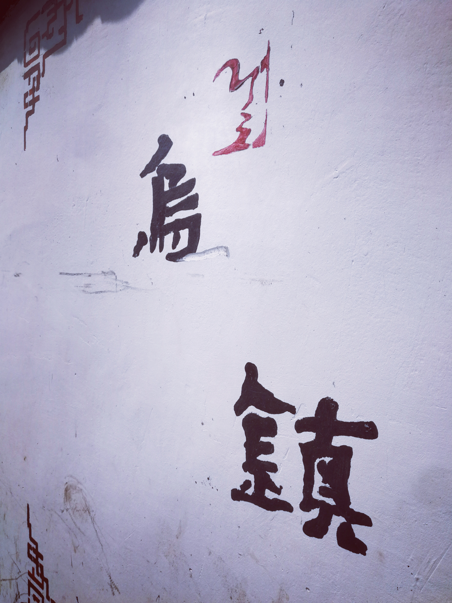

*走在东栅到西栅的路上，旁边是清一色的白墙灰瓦*

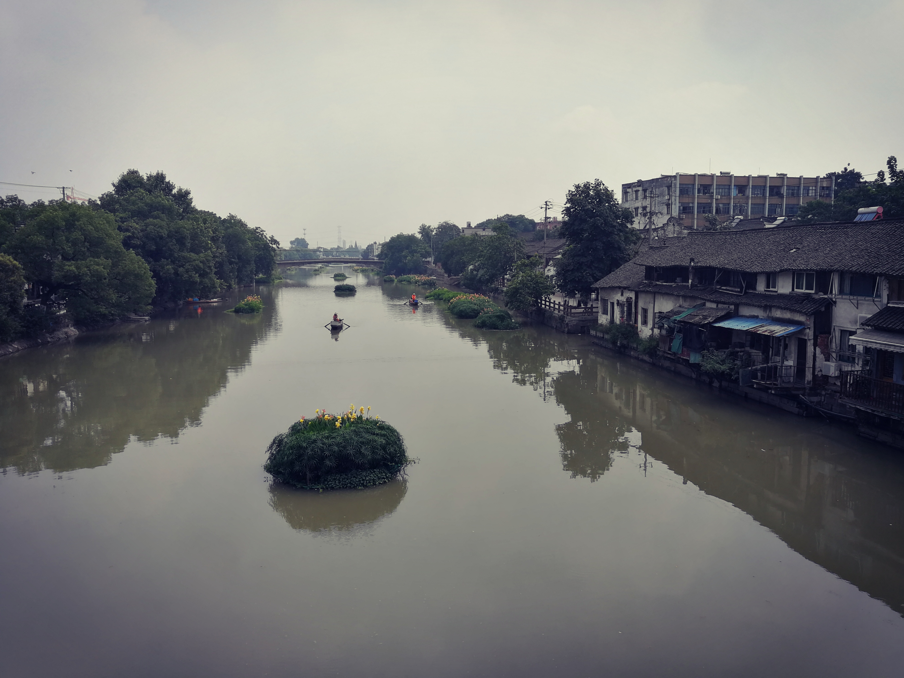

*站在桥上*

游西栅

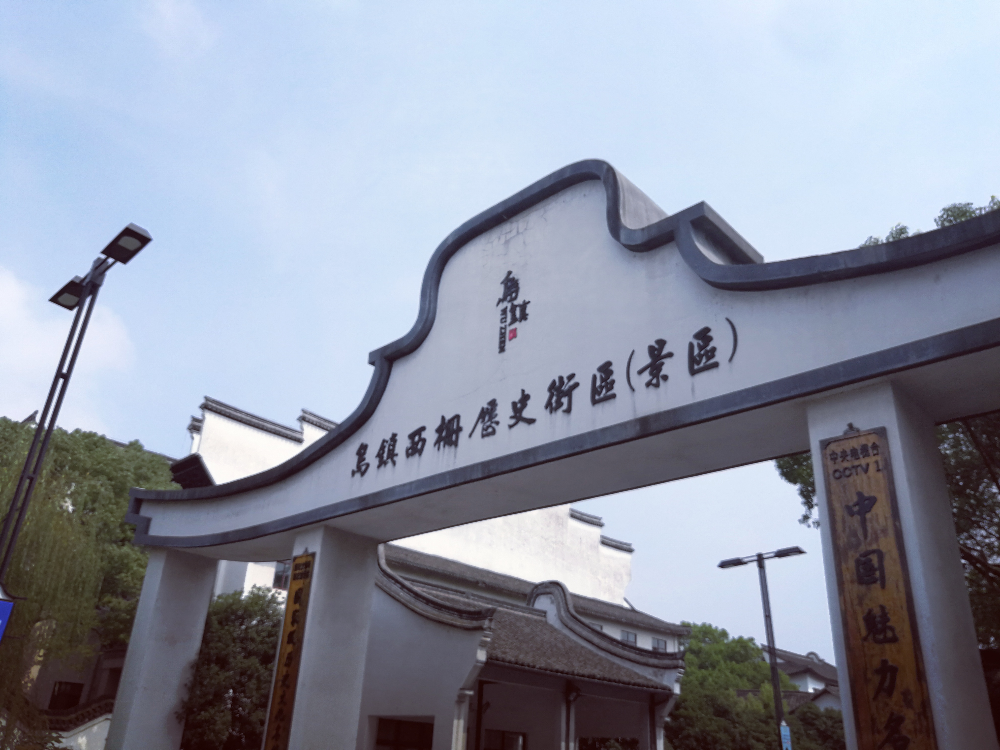

*顶着大太阳走了近半个小时才到西栅，有点后悔没有等景区的直达车*

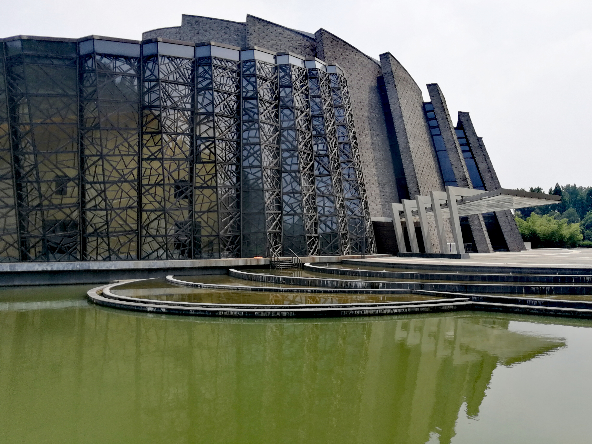

*从西栅景区大门进去后，转个弯就是乌镇大剧院，平铺在水上*

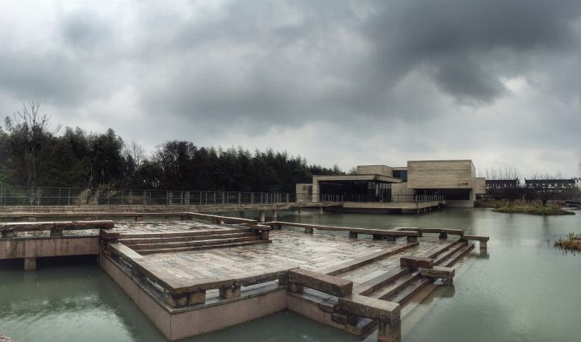

*随后就是木心美术馆，不过周一没开门，有点遗憾*

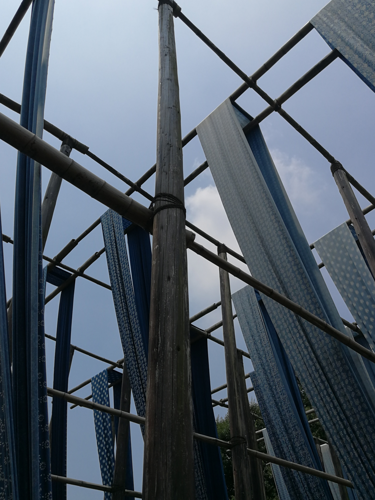

*染坊的晾晒场*

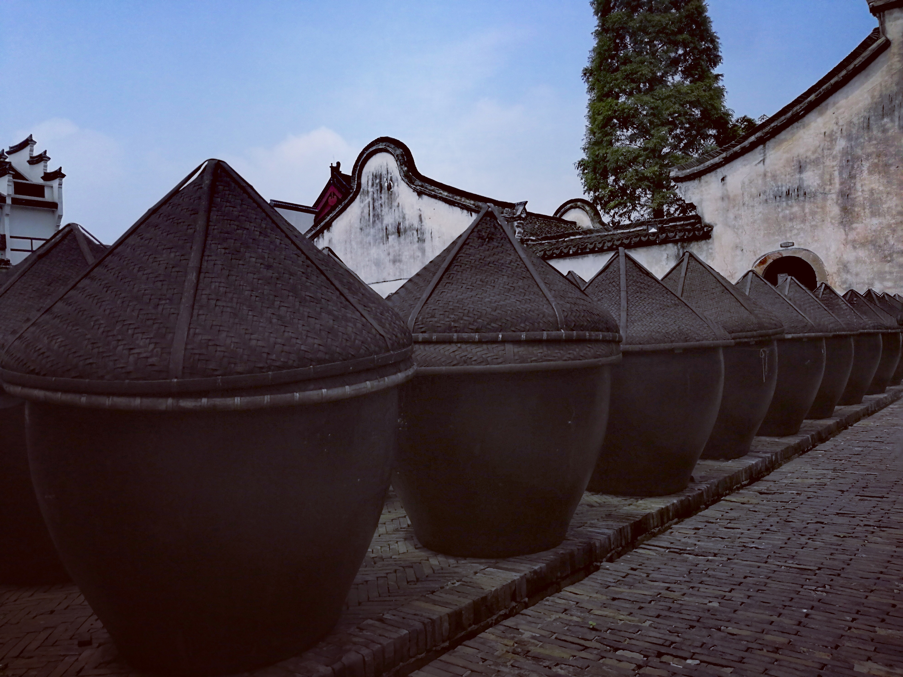

*叙昌酱园里飘着浓厚的酱香*

*透过青石小道旁树木的空隙可以看到一排排停在水面上的乌篷船*

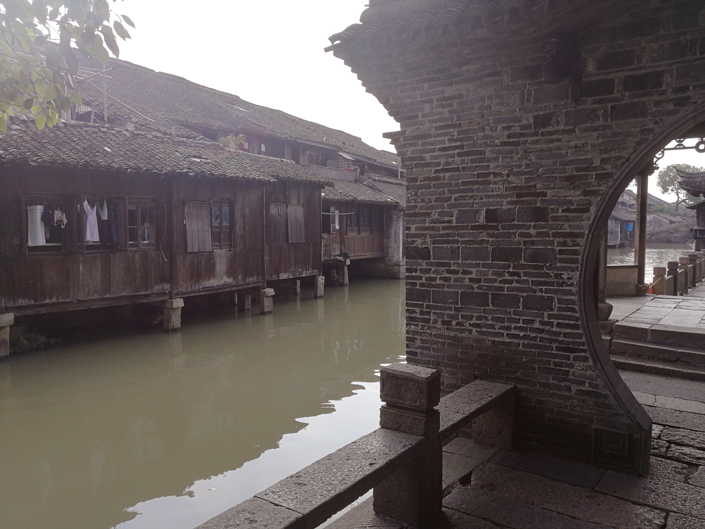

*圆形拱门与水上的木房子*

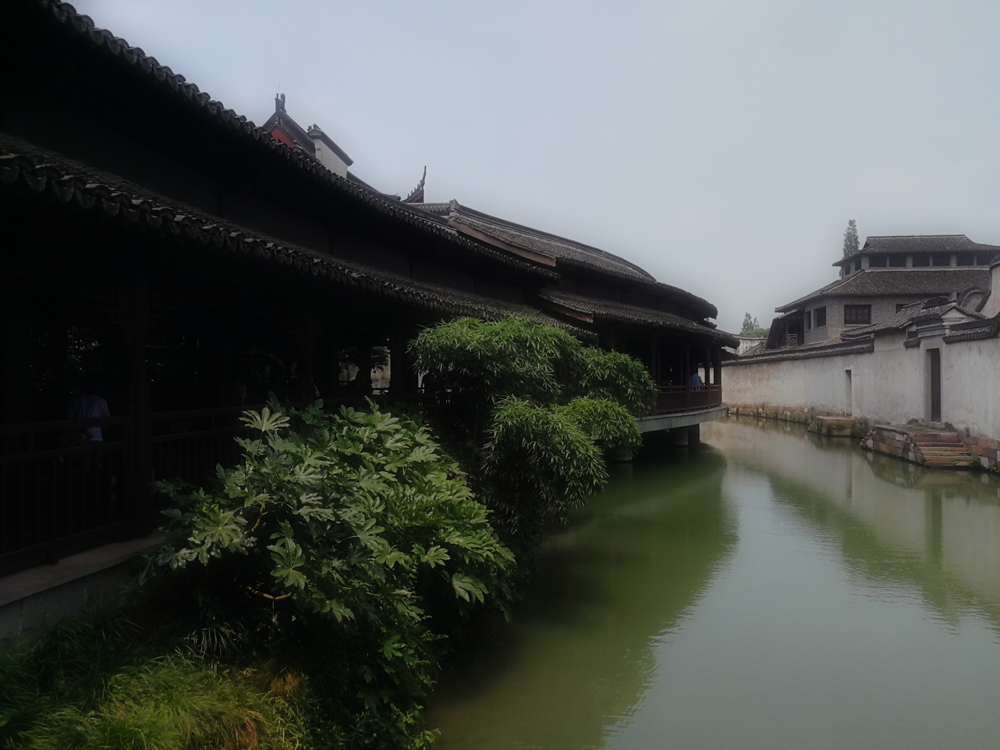

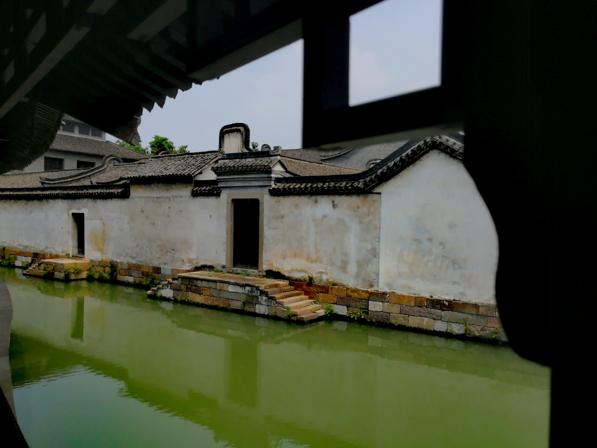

*各家门前修到水面上的石梯或许是浣洗用的*

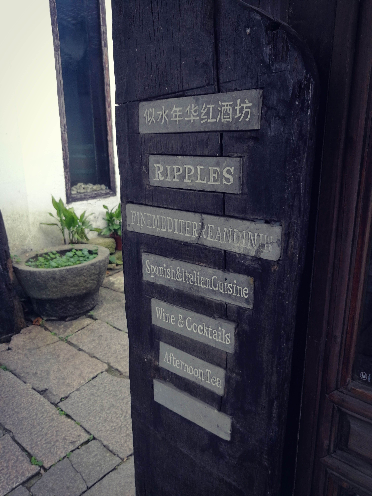

*黄磊的酒坊*

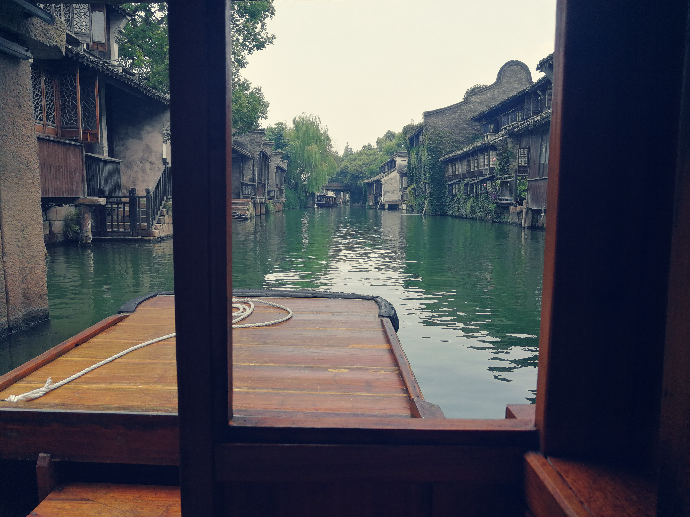

*坐在乌篷船上，船下流着的是京杭大运河的支流*

下午从桐乡站乘高铁到昆山。