导入一幅128X128的8bit灰度图像，在ARM 处理器上编程，使图像顺时针旋转45度，并导出图像。

<!-- more -->

**开发环境：**

>操作系统：macOS BigSur v11.6
>
>IDE：SEGGER Embedded Studio for ARM v5.60a
>
>ARM Architecture：v4T
>
>ARM Core Type：ARM920T

# 解题步骤

## 思路梳理

将任务拆分为两步：

​	**step1：**编写能够在PC上顺利执行的旋转灰度图像的C代码。

​	**step2：**将编写好的C代码在segger中新建的ARM9处理器项目中执行，观察执行结果，解决出现的问题。

## 使用C语言读写灰度图像

首先解决C读取并写入RAW格式灰度图像的问题。使用C语言库函数`fopen()`, `fread()`, `fwrite()`。

**step1：**读入raw灰度图像文件 

```c
FILE *fp = NULL;  
// 打开raw图像文件  
if((fp = fopen( "./assets/butter128.raw", "rb" )) == NULL) {  
  printf("can not open the raw image! \n" );  
  return 0;  
} else {  
  printf("open file successly！\n");  
}
```

**step2：**将图像数据读取到二维数组中

```c
#define height  128
#define width   128 

typedef unsigned char  BYTE;   // define BYTE type， 1 char

BYTE origin[height][width];  
BYTE *ptr;  
int i,j;  
// 根据图像大小分配存储内存
ptr = (BYTE*)malloc( width * height * sizeof(BYTE) );  
for( i = 0; i < height; i++ ) {  
  for( j = 0; j < width ; j ++ ) {
    // 逐字节读取图像数据，并写入内存
    fread( ptr, 1, 1, fp );  
    origin[i][j]= *ptr;  // 把图像数据输入到2维数组中,转为矩阵
    printf("%d  ",origin[i][j]);
    ptr++;  
  }  
  // 查看读取进度
  if(i%10==0){printf("reading...%d\n", i);}
}
// 关闭打开的文件
fclose(fp);  
```

**step3：**将二维数组中的数据输出到新的图像文件中

```c
BYTE result[height][width] = {0};
// 新建图像文件
if( ( fp = fopen( "./result/rotateResult.raw", "wb" ) ) == NULL ) {  
  printf("can not create the raw_image : %s\n", "./result/rotateResult.raw" );  
  return 0;  
}  

for( i = 0; i < height; i++ ) {  
	for( j = 0; j < width ; j ++ ) {
    // 将矩阵数据逐字节写入结果文件中
		fwrite( &result[i][j], 1 , 1, fp );  
	}  
  // 查看写入进度
  if(i%10==0){printf("writing...%d\n", i);}
}  
fclose(fp);  
```

## 旋转图像算法设计

将图像顺时针旋转45度，即将图像对应的矩阵旋转45度

将矩阵旋转45度，需要插入空白值，如下图所示(A为矩阵数组中的(0,0)点)

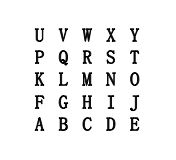

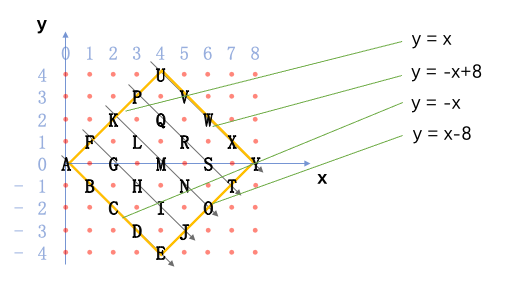

旋转算法思路如下

1. 记原始矩阵为`origin[8][8]`, 矩阵旋转扩充后的矩阵为`result[15][15]`，所有点初始化为0
2. 按照如图所示顺序为result赋值，矩阵坐标变化存在规律性
3. 菱形区域的边界函数确定需要赋值的边界范围

旋转算法代码如下：

```c
int resultHeight =  255;
BYTE result[255][255] = {0};
int startx = 0;
int starty = 0;
// starty转diamond行：127-starty
for(int i = 0; i < height; i++){
  for(int j =0; j < width; j++){
    if(isInDiamond(startx+j, starty-j)){
      result[startx+j][127-(starty-j)] = origin[i][j];
    }
    // 查看处理进度
    if(i%10==0){printf("rotating...%d\n", i);}
  }
  startx += 1;
  starty += 1;
}
```

## 程序在PC上运行结果

旋转前：

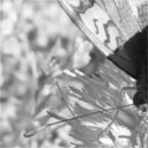

旋转后：

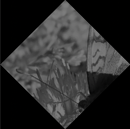

## 代码放入segger新建ARM9处理器项目中执行

将以上代码综合后，在segger新建ARM9处理器项目中执行，出现了一系列的问题，记录如下

### 读取资源路径问题

在segger项目中，与C项目不同的是，使用`./`所定位的文件位置并不是`main.c`文件所在的目录，而是整个项目的根目录，在读取图片时需要注意路径。

如下图：`./`并不是定位到Source文件夹中，而是整个`Executable_1`的根目录中。

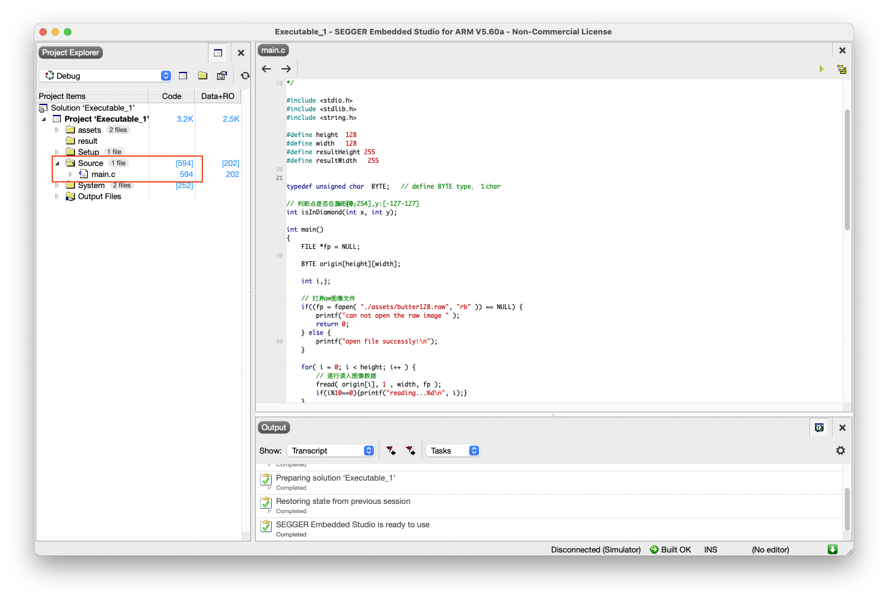


### `printf`速度限制程序执行速度

在最初程序中，为了观测`fread`读入的图像数据，会将每一个像素的灰度值输出，在PC端测试时，执行速度很快，但在ARM9模拟器上时，`printf`速度会明显限制程序的执行速度，因此将`printf`语句注释不执行。

### 逐字节读取图像数据在项目中引发程序异常

在从文件流中逐字节读取图像数据时，读取到一半会出现错误`Unknown function at 0x00000004`。

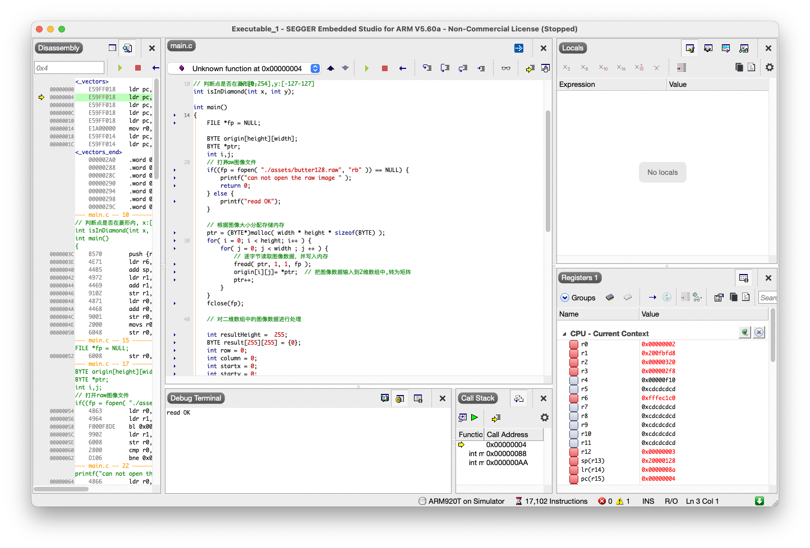

怀疑是ARM9处理器在反复打开文件流读取数据时会因性能产生异常，将逐字节读取改为一次性读取所有数据，错误消失。

```c
// 一次性读入所有数据
fread( ptr, 1, width*height, fp ); 
```

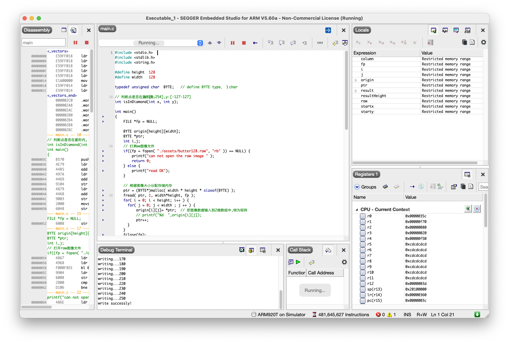

### 逐字节写入图像数据程序执行缓慢

将矩阵数据逐字节写入图像时，执行速度缓慢，大约需要30～40s才能执行结束。

将逐字节写入改为逐行写入，执行速度大大提升，只需要3s左右便可执行完成。

### 使用`malloc()`函数分配的内存空间写入图像数据时数据出现错误

在解决了读取和写入图像文件数据的问题后，发现了新的问题，虽然将图像读到了矩阵中，但读取的数据有误。

**将图片读取之后不做任何处理再输出，发现图片数据异常。**输出结果如下：

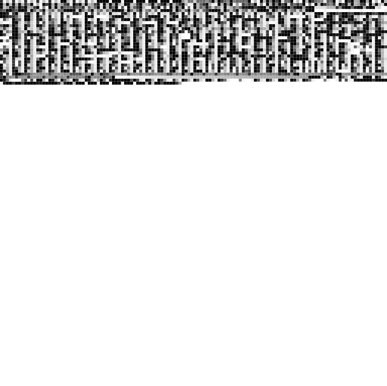

旋转后的结果如下：

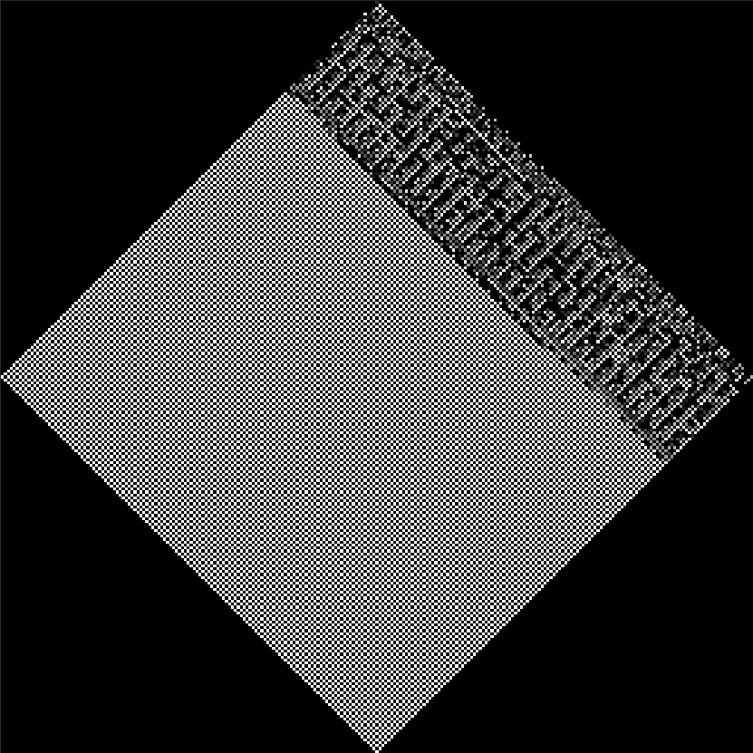

反复实验后发现，使用`malloc()`函数分配内存空间时，当图片比较小（如8*8像素）时，程序执行正常，但当图片尺寸较大时，从文件流读取数据会导致数据出现错误，将代码改为直接将数据逐行读入二维数组中，程序执行正常。

```c
for( i = 0; i < height; i++ ) {  
  // 逐行读入图像数据
  fread( origin[i], 1 , width, fp ); 
  if(i%10==0){printf("reading...%d\n", i);}
}
```

至此，最终项目顺利运行。

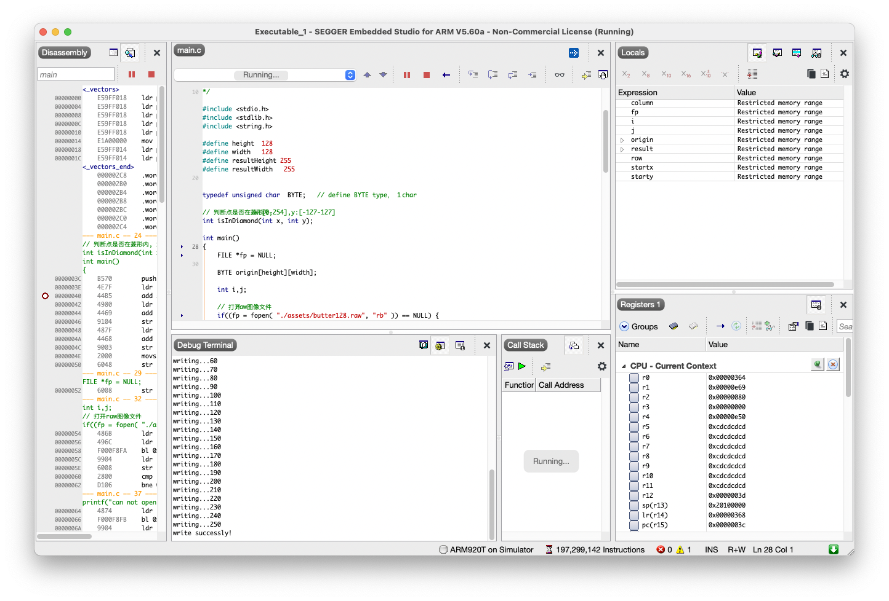

旋转结果：


## 初步代码

根据以上过程，得出图像旋转的初步代码：

```c
#include <stdio.h>  
#include <stdlib.h>  
#include <string.h>  
  
#define height  128
#define width   128 
#define resultHeight 255
#define resultWidth   255

  
typedef unsigned char  BYTE;   // define BYTE type， 1 char
  
// 判断点是否在菱形内, x:[0-254],y:[-127-127]
int isInDiamond(int x, int y);
  
int main()  
{  
    FILE *fp = NULL;  
      
    BYTE origin[height][width];
      
    int i,j;  
      
    // 打开raw图像文件  
    if((fp = fopen( "./assets/butter128.raw", "rb" )) == NULL) {  
        printf("can not open the raw image " );  
        return 0;  
    } else {  
        printf("open file successly！\n");  
    }   

    for( i = 0; i < height; i++ ) {  
        // 逐行读入图像数据
        fread( origin[i], 1 , width, fp ); 
        if(i%10==0){printf("reading...%d\n", i);}
    }
    fclose(fp);  
      
    // 对二维数组中的图像数据进行处理  

    BYTE result[resultHeight][resultWidth] = {0};
    int row = 0;
    int starty = 0;
    // starty转diamond行：127-starty
    for(i = 0; i < height; i++) {
        for(j =0; j < width; j++) {
            if(isInDiamond(startx+j, starty-j)){
                result[startx+j][(resultWidth-1)/2-(starty-j)] = origin[i][j];
            }
        }
        if(i%10==0){printf("rotating...%d\n", i);}
        startx += 1;
        starty += 1;
    }

      
    // 将处理后的图像数据输出至文件   
    if( ( fp = fopen( "./result/rotateResult.raw", "wb" ) ) == NULL )  
    {  
        printf("can not create the raw_image : %s\n", "./result/rotateResult.raw" );  
        return 0;  
    }  
      

    for( i = 0; i < resultHeight; i++ ) {  
        fwrite( result[i], 1 , resultWidth, fp );  
        if(i%10==0){printf("writing...%d\n", i);}
    } 

    printf("write successly!" );  
    fclose(fp);  
  
}  

// 判断点是否在菱形内, x:[0-254],y:[-127-127]
// y=x,y=-x+254,y=-x,y=x-254
int isInDiamond(int x, int y){
    if(y <= x && y >= -x && y<= resultHeight-1-x && y >= x-(resultHeight-1)){
        return 1;
    } else {
        return 0;
    }
}
```

# 旋转算法优化——双线性内插值

以上代码虽然能够完成图片的旋转，但是由于使用了简单的插入空白值算法，成像质量较差，并且原图的尺寸是`128*128`，旋转之后图片尺寸到了`255*255`,  图片内容部分的宽度由128扩大到了182左右，旋转算法有待提升。

查阅资料发现，常用的图片旋转算法有**最邻近插值**，**双线性内插值**，以及**双立方（三次）卷积法**等，最邻近插值计算最为简便，但质量不高；双线性插值计算稍复杂，但效果较好；双立方（三次）卷积法计算最为复杂，效果也最好；考虑到ARM9处理器的性能，准备选用**双线性内插值法**进行图片旋转。

首先考虑图片旋转，设旋转度数为$\theta$，原图像某像素点坐标为$(x_0,y_0)$，旋转后图像对应像素点坐标为$(x,y)$，则有对应关系：
$$
x_0 = xcos\theta+ysin\theta \\
y_0 = xsin\theta+xcos\theta \\
（注意：x_0,y_0为小数时可以向下取整，结果变化不大）
$$
双线性内插值算法的基本思想如下：

对于一个目的像素，设置坐标通过反向变换得到的浮点坐标为$(i+u,j+v)$，其中$i$、$j$均为非负整数，$u$、$v$为$[0,1)$区间的浮点数，则这个像素得值$ f(i+u,j+v) $可由原图像中坐标为$ (i,j)、(i+1,j)、(i,j+1)、(i+1,j+1)$所对应的周围四个像素的值决定，即：
$$
f(i+u,j+v) = \\ (1-u)(1-v)f(i,j) + (1-u)vf(i,j+1) \\+ u(1-v)f(i+1,j) + uvf(i+1,j+1)
$$
其中$f(i,j)$表示源图像$(i,j)$处的的像素值。

根据以上思想，写出**双线性内插值算法**的C代码：

```c
#define PI 3.1415926
#define height  128
#define width   128 
#define Angle 45
#define height_aft 182 // (int)ceil(fabs(height*cos(angle)) + fabs(width*sin(angle)))
#define width_aft 182 // (int)ceil(fabs(width*cos(angle)) + fabs(height*sin(angle)))

int midX_pre,midY_pre,midX_aft,midY_aft;//旋转前后的中心点的坐标
midX_pre = width / 2;
midY_pre = height / 2;
int pre_i,pre_j,after_i,after_j;//旋转前后对应的像素点坐标
double fpre_i, fpre_j;
double angle = (double)1.0 * Angle * PI / 180;
midX_aft = width_aft / 2;
midY_aft = height_aft / 2;

BYTE result[height_aft * width_aft];
for(i = 0;i < height_aft;i++) {
  for(j = 0;j < width_aft;j++) {
    result[i * width_aft + j] = 0;
    after_i = i - midX_aft;
    after_j = j - midY_aft;
    fpre_i = cos(angle) * after_i - sin(angle) * after_j + midX_pre;
    fpre_j = sin(angle) * after_i + cos(angle) * after_j + midY_pre;
    pre_i = (int)fpre_i;
    pre_j = (int)fpre_j;
    double u = fpre_i - pre_i;
    double v = fpre_j - pre_j;
    if(pre_i >= 0 && pre_i < height && pre_j >= 0 && pre_j < width) {//在原图范围内
      result[i * width_aft + j] = (1-u)*(1-v)*origin[pre_i * width + pre_j] + 
        (1-u)*v*origin[pre_i * width + pre_j+(pre_j == width - 1 ? 0 : 1 )] + 
        u*(1-v)*origin[(pre_i+(pre_i == height - 1 ? 0 : 1 )) * width + pre_j] + 
        u*v*origin[(pre_i+(pre_i == height - 1 ? 0 : 1 )) * width + pre_j+(pre_j == width - 1 ? 0 : 1 )];
    }
  }
  if(i%10==0){printf("rotating...%d\n", i);}
}
```

旋转图像如下所示，可以看出旋转图像的质量有明显的改善：

原图：


优化前：


优化后：

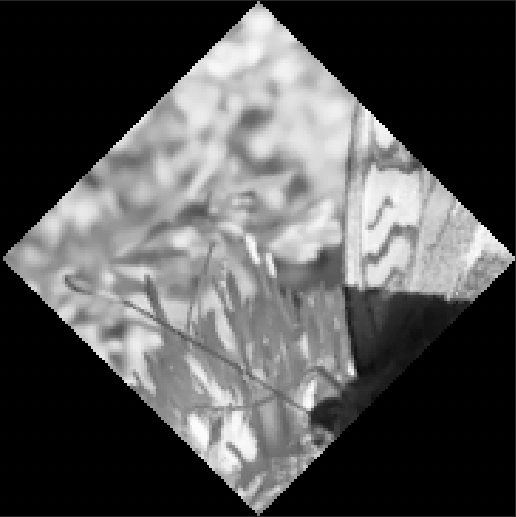

# 最终完整代码

```c
#include <stdio.h>
#include <stdlib.h>
#include <math.h>

#define PI 3.1415926

#define height  128
#define width   128 
#define Angle 45
#define height_aft 182 // (int)ceil(fabs(height*cos(angle)) + fabs(width*sin(angle)))
#define width_aft 182 // (int)ceil(fabs(width*cos(angle)) + fabs(height*sin(angle)))

typedef unsigned char  BYTE;   // define BYTE type， 1 char

int main(){
    FILE *fp = NULL;  
      
    BYTE origin[height * width];
    // 打开raw图像文件  
    if((fp = fopen( "./assets/butter128.raw", "rb" )) == NULL) {  
        printf("can not open the raw image\n " );  
        return 0;  
    } else {  
        printf("read successly!\n");  
    } 

    int i, j;
    for( i = 0; i < height; i++ ) {  
        // 逐行读入图像数据
        fread( &origin[i*width], 1 , width, fp ); 
        if(i%10==0){printf("reading...%d\n", i);}
    }
    fclose(fp);

    int midX_pre,midY_pre,midX_aft,midY_aft;//旋转前后的中心点的坐标
    midX_pre = width / 2;
    midY_pre = height / 2;
    int pre_i,pre_j,after_i,after_j;//旋转前后对应的像素点坐标
    double fpre_i, fpre_j;
    double angle = (double)1.0 * Angle * PI / 180;
    midX_aft = width_aft / 2;
    midY_aft = height_aft / 2;

    BYTE result[height_aft * width_aft];
    for(i = 0;i < height_aft;i++) {
        for(j = 0;j < width_aft;j++) {
            result[i * width_aft + j] = 0;
            after_i = i - midX_aft;
            after_j = j - midY_aft;
            fpre_i = cos(angle) * after_i - sin(angle) * after_j + midX_pre;
            fpre_j = sin(angle) * after_i + cos(angle) * after_j + midY_pre;
            pre_i = (int)fpre_i;
            pre_j = (int)fpre_j;
            double u = fpre_i - pre_i;
            double v = fpre_j - pre_j;
            if(pre_i >= 0 && pre_i < height && pre_j >= 0 && pre_j < width) {//在原图范围内
              result[i * width_aft + j] = (1-u)*(1-v)*origin[pre_i * width + pre_j] + 
                                          (1-u)*v*origin[pre_i * width + pre_j+(pre_j == width - 1 ? 0 : 1 )] + 
                                          u*(1-v)*origin[(pre_i+(pre_i == height - 1 ? 0 : 1 )) * width + pre_j] + 
                                          u*v*origin[(pre_i+(pre_i == height - 1 ? 0 : 1 )) * width + pre_j+(pre_j == width - 1 ? 0 : 1 )];
            }
        }
        if(i%10==0){printf("rotating...%d\n", i);}
    }

    // 将处理后的图像数据输出至文件   
    if( ( fp = fopen( "./result/rotateResult.raw", "wb" ) ) == NULL )  
    {  
        printf("can not create the raw_image : %s\n", "./result/rotateResult.raw" );  
        return 0;  
    }  
      
    for( i = 0; i < height_aft; i++ ) {  
        fwrite( &result[i*width_aft], 1 , width_aft, fp );  
        if(i%10==0){printf("writing...%d\n", i);}
    } 
    printf("write successly!" );  
    fclose(fp); 
}

```

