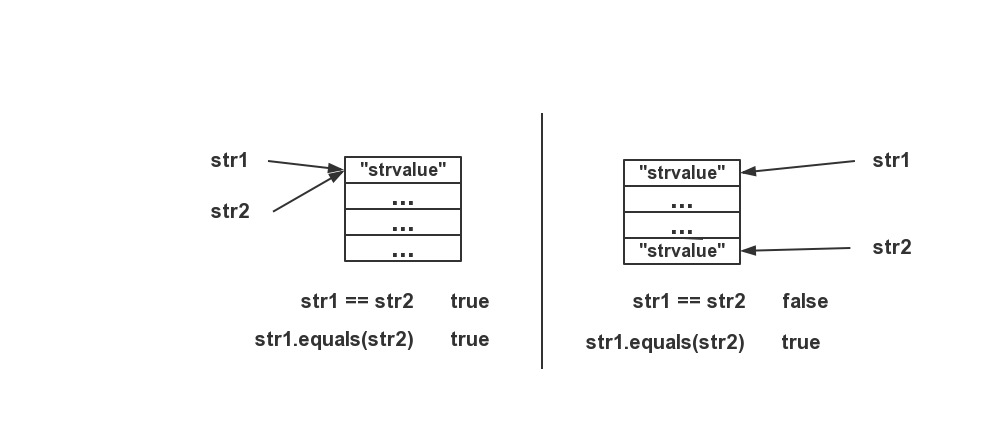

在学习[设计模式]( http://c.biancheng.net/design_pattern/ )中的Prototype Patterns时，了解到Java的根类Object提供了一个clone()方法（Object是所有类的父类，其一共提供了11个方法，具体详解可以看[这篇文章](https://fangjian0423.github.io/2016/03/12/java-Object-method/ )），可以很容易实现Prototype Patterns。但clone()方法有浅克隆和深克隆两种，其中涉及到了java基本数据类型与其他数据类型的值与地址的问题。

<!--more-->

</br>

# 1. java的基本数据类型与引用数据类型

                        ┏数值型━┳━整数型：byte、short、int、long
           
           ┏基本数据类型━┫      ┗━浮点型：float、double
           
           ┃            ┣字符型：char
    
    数据类型╋            ┗布尔型：boolean
           
           ┃            ┏类（class）
    
           ┗引用数据类型━╋接口（interface）
    
                        ┗数组（array）

Java中有两类数据类型：基本数据类型与引用数据类型，**基本数据类型直接保存数据的值，而引用数据类型只保存指向存储其所表示的值的地址**。以String与int为例，String是Java的一个类，属于引用数据类型，所以String其实相当于一个指针（当然指针只是借用C++里的说法，Java中是没有指针的），而int属于基本数据类型，其声明的变量直接存储值。

</br>

## 1.1简要说明

对于引用数据类型来说，当声明一个String类型的变量`str1`并为其赋字符串值`"strvalue"`时，会将该字符串值`"strvalue"`存储在字符串常量池中，如果有一个新的String类型的变量`str2`被声明并且同样为其赋值`"strvalue"`的话，`str1`与`str2`会指向同一个地址（即存储`“strvalue”`的物理空间），两者共用同一个物理空间。`str1`与`str2`的值其实是地址值。

而对于基本数据类型来说，如果令`int num1 = 123`，`int num2 = 123`，`num1`和`num2`是不共用一个物理空间的。即`num1`和`num2`分别有各自的物理空间来存储`123`。

</br>

## 1.2 用代码说明

**首先要明白判断两字符串相等时String的`"str1==str2"`与`"str1.equals(str2)"`的区别**

`"=="`返回`true`时代表`str1`和`str2`指向同一个物理空间。

`equals`返回`true`时代表`str1`和`str2所指向的物理空间中存储的String值相等，并不需要两者同时指向一个物理空间，如下图：




**再跟据以下代码说明String与int的不同：**

```java
public class test {
    public static void main(String[] args) {
        //这种情况下str1与str2指向同一个物理空间，值也相同
        String str1 = "strvalue";
        String str2 = "strvalue";   //这里String str2 = "strvalue"与String str2 = str1是完全相同的
        System.out.println("str1 == str2: " +  (str1 == str2));
        System.out.println("str1.equals(str2): " +  (str1.equals(str2)));


        //如果通过new String()的方法来声明str3与str4，两者会指向不同的物理空间
        String str3 = new String("strvalue");
        String str4 = new String("strvalue");
        System.out.println("str3 == str4: " +  (str3 == str4));
        System.out.println("str3.equals(str4): " +  (str3.equals(str4)));
    }
}
```

输出：

```java
str1 == str2: true           //说明str1与str2指向一物理空间
str1.equals(str2): true		 //说明str1与str2所指向的物理空间中存储的值相等
str3 == str4: false			 //说明str3与str4不指向一物理空间
str3.equals(str4): true		 //说明str3与str4所指向的物理空间中存储的值相等
```

# 2. Java的根类Object的clone()方法

## 2.1 为什么要有clone()方法？

首先说明clone方法是用来干什么的，我们都知道一般要创建一个新的对象时，往往是通过`new`关键字实现的。

试想这样的一种情况，有一个类`Chicken`，在一开始时我们创建了一个`Chicken`对象`chicken1`，它有很多属性，如年龄、饥饿度、体重、性别等等一系列属性，这些属性会随着时间的变化而变化。

现在存在着这样的一种需求，我想要把`chicken1`复制很多份，每一份都是一个新的对象，这些对象的所有属性都要和`chicken1`一样。

那么这时候你可能会想，我可以先`new`出来很多新的`Chicken`对象，然后根据`chicken1`的属性对这些新的对象的属性进行一一赋值，但是你可能会发现，这个工作是很繁琐的，你要遍历`Chicken`里的每一个属性并对其一一赋值。

那么如何优化呢，这时候就需要用到`clone()`方法了，直接用`Chicken chicken2 = (Chicken)chicken1.clone()`可以得到一个与`chicken1`一样的新对象`chicken2`。

</br>

可能你还这样想过：

**`Chicken chicken2 = chicken1`能到一个新对象吗**

看这样一段代码：

```java
public class Chicken{
    public String name = "chickenname";

    public static void main(String[] args){
        
        Chicken chicken1 = new Chicken();
        Chicken chicken2 = chicken1;
        
        System.out.println("chicken1指向的物理空间的地址："+chicken1);
        System.out.println("chicken2指向的物理空间的地址："+chicken2);
    }
}

```

输出：

```bash
chicken1指向的物理空间的地址：Chicken@16d3586
chicken2指向的物理空间的地址：Chicken@16d3586
```

你会发现`Chicken chicken2 = chicken1`所得到的`chicken2`并不是一个新对象，它与`chicken1`指向同一个物理空间，更改`chicken1`时`chicken2`也会随之改变。

因此，要想得到两个一模一样的对象，只能通过new然后逐一对属性赋值和clone()两种方法来试现。


## 2.2 clone方法的具体用法

要想使用clone()方法，必须在类中实现Cloneable接口，如下：

```java
public class Chicken implements Cloneable{
    public int age = 0;

    @Override
    protected  Object clone()throws CloneNotSupportedException{
        Chicken newchicken = (Chicken) super.clone();
        return newchicken;
    }
}
```

到此，我们已经可以初步的用一下clone()方法了，如下:

```java
public class Chicken implements Cloneable{
    private  int age = 0;

    public int getAge(){
        return this.age;
    }

    public  void setAge(int age){
        this.age = age;
    }

    @Override
    protected  Object clone()throws CloneNotSupportedException{
        Chicken newchicken = (Chicken) super.clone();
        return newchicken;
    }

    public static void main(String[] args) throws CloneNotSupportedException {

        Chicken chicken1 = new Chicken();
        chicken1.setAge(1);
        Chicken chicken2 = (Chicken) chicken1.clone();

        System.out.println("chicken1指向的物理空间的地址："+chicken1);
        System.out.println("chicken2指向的物理空间的地址："+chicken2);
        System.out.println("chicken1的age："+chicken1.getAge());
        System.out.println("chicken2的age："+chicken2.getAge());
    }
}
```

输出：

```bash
chicken1指向的物理空间的地址：Chicken@16d3586
chicken2指向的物理空间的地址：Chicken@154617c
chicken1的age：1
chicken2的age：1
```

可以发现，`chicken1`与`chicken2`指向的地址不同，即二者是两个对象，而且我们并没有对`chicken2`的`age`进行设置，但它的值却不是初始化的`0`而是与`chicken1`的`age`相同，为`1`。能够很好的说明，我们的clone()方法得到了实现。

但是，要想深入理解clone()方法，现在还不算完。

clone()方法分为**浅克隆**（浅拷贝）与**深克隆**（深拷贝）两种。

### 2.2.1 浅克隆

看下面的例子：

```java
public class Chicken implements Cloneable{
    private  int age = 0;
    private String name = "chickenname";

    public int getAge(){
        return this.age;
    }

    public  void setAge(int age){
        this.age = age;
    }

    public String getName(){
        return this.name;
    }

    public void setName(String name){
        this.name = name;
    }


    @Override
    protected  Object clone()throws CloneNotSupportedException{
        Chicken newchicken = (Chicken) super.clone();
        return newchicken;
    }

    public static void main(String[] args) throws CloneNotSupportedException {

        Chicken chicken1 = new Chicken();
        Chicken chicken2 = (Chicken) chicken1.clone();

        System.out.println("chicken1 == chicken2 : " + (chicken1 == chicken2) );
        System.out.println("chicken1.name.equals(chicken2.name) : "
                +  (chicken1.getName().equals(chicken2.getName()));
        System.out.println("chicken1.name == chicken2.name : "
                +  (chicken1.getName() == chicken2.getName()));
    }
}
```

输出：

```java
chicken1 == chicken2 : false					//chicken1与chicken2两者地址不同
chicken1.name.equals(chicken2.name) : true		//两者name的值相同
chicken1.name == chicken2.name : true			//两者name的地址相同
```

通过上面的例子我们就可以看出来什么是**浅克隆**了，当执行`clone()`方法时，对于`Chicken`类里面的属性：

●如果其属于八个基本数据类型中的一个，例如`Chicken`中的`age`属性，那么`chicken2`的`age`与`chicken1`的`age`对应不同的物理空间；

●如果其属于引用数据类型(不属于八大基本数据类型的都是引用数据类型，如自定义的类、String、enum等)，例如`Chicken`中的`name`属性，那么`chicken2`的`name`与`chicken1`的`name`共用一个物理空间，并没有真正的把`name`拷贝过去，但是不影响我们的使用。

### 2.2.1 深克隆

既然浅克隆不会为引用数据类型真正克隆一个物理空间，那么深克隆的概念就呼之欲出了，深克隆自然就是**会为类中的引用数据类型的属性克隆一个新的物理空间**。

那么该如何实现深克隆呢？还记得我们在上面的1.2的代码中写的如何真正拷贝一个不同地址的String的方法吗？那就是new一个String。

如下：

```java
public class Chicken implements Cloneable{
    private String name = "chickenname";

    private String getName(){
        return this.name;
    }

    private void setName(String name){
        this.name = name;
    }


    @Override
    protected  Object clone()throws CloneNotSupportedException{
        Chicken newchicken = (Chicken) super.clone();
        newchicken.name=new String(this.name);
        return newchicken;
    }

    public static void main(String[] args) throws CloneNotSupportedException {

        Chicken chicken1 = new Chicken();
        Chicken chicken2 = (Chicken) chicken1.clone();

        System.out.println("chicken1 == chicken2 : " + (chicken1 == chicken2) );
        System.out.println("chicken1.name.equals(chicken2.name) : "
                +  (chicken1.name.equals(chicken2.name)));
        System.out.println("chicken1.name == chicken2.name : "
                +  (chicken1.name == chicken2.name));
    }
}
```

输出：

```java
chicken1 == chicken2 : false					//chicken1与chicken2两者地址不同
chicken1.name.equals(chicken2.name) : true		//两者name的值相同
chicken1.name == chicken2.name : flase			//两者name的地址不相同
```

这就是深克隆了，当然这里只提供了一个很简单的例子String，另外的还有如果属性有自定义的类的深克隆（假如Chicken中的属性里有一个我们自定义的Egg类），这时候就需要在Egg类中也提供clone()方法（而且要是深克隆）。更复杂的是如果Egg中的属性还有自定义的类，那么就要层层检查，保证每一层的类都要提供深克隆的clone()方法。这样是非常麻烦的，当然，我们只需要在理论上的理解即可，在实际应用中，我们几乎从不需要这样做。

**End**

PS：码了三个小时\_(:з)∠)\_，本来只想先码一点儿，但是一码就不想停下来。。。还有一大堆作业等着呢(ㄒoㄒ)

</pr>

</pr>

参考链接：

>  [JAVA基本数据类型与引用数据类型](https://blog.csdn.net/Coding_Zhu/article/details/53096178) 
>
> [深入理解Java中的String（大坑）]( https://blog.csdn.net/qq_34490018/article/details/82110578 )
>
> [详解Java中的clone方法 -- 原型模式]( https://blog.csdn.net/zhangjg_blog/article/details/18369201 )