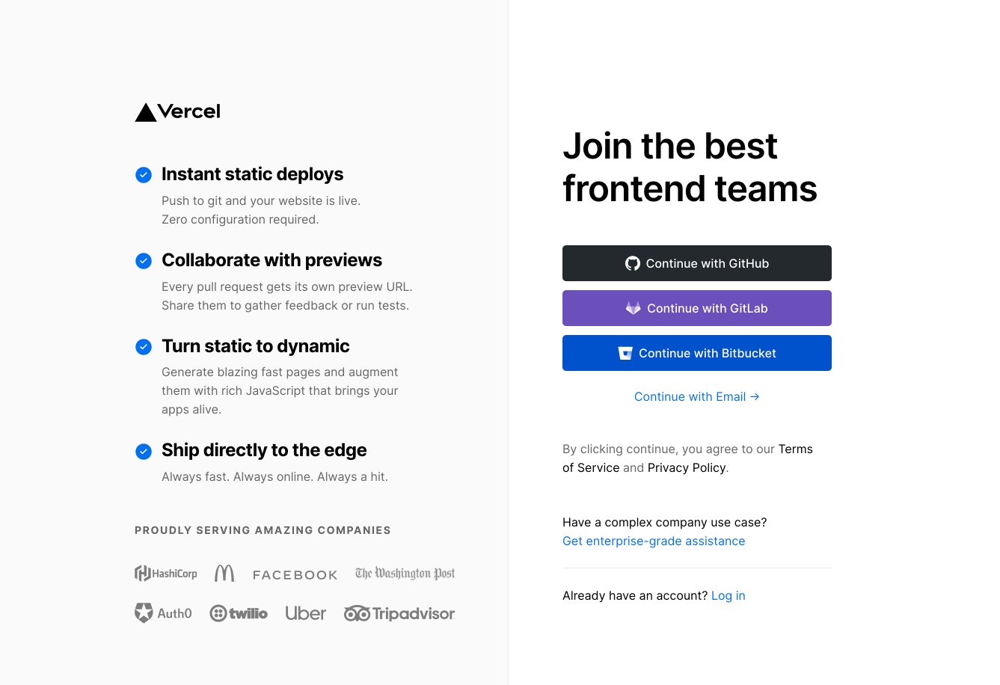
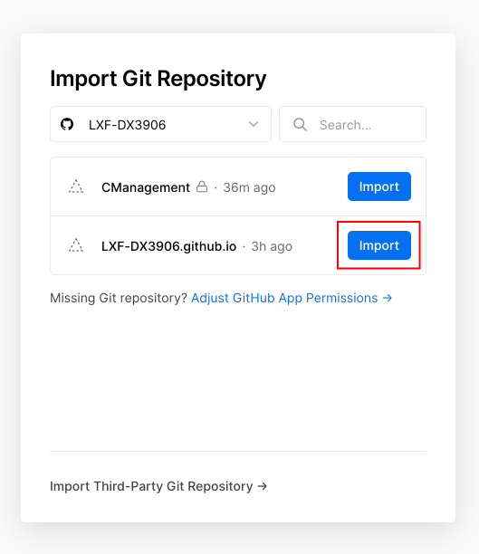
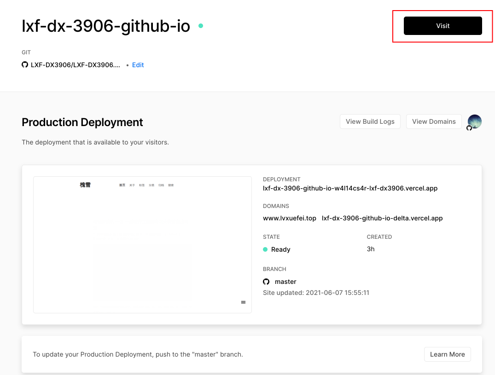
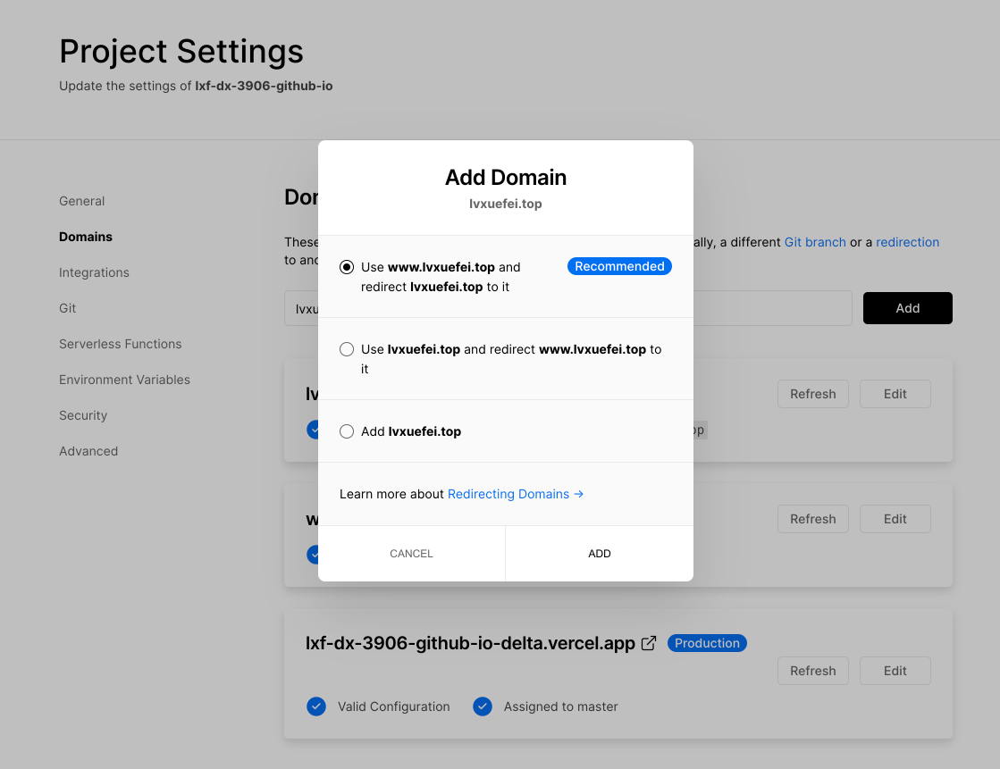
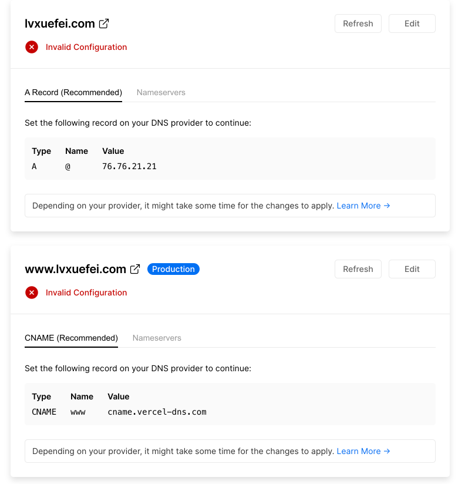
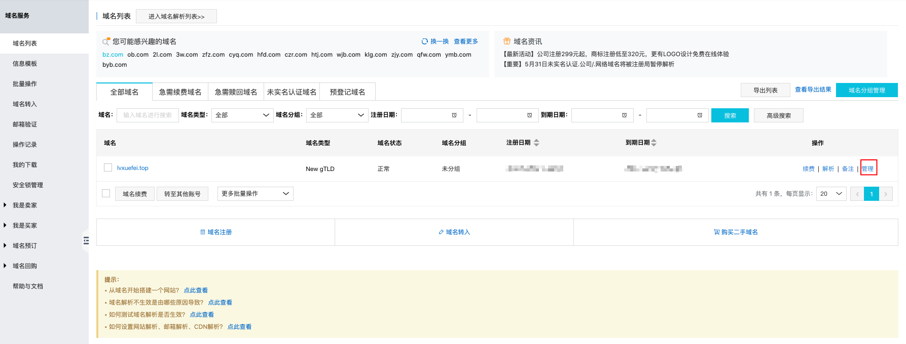
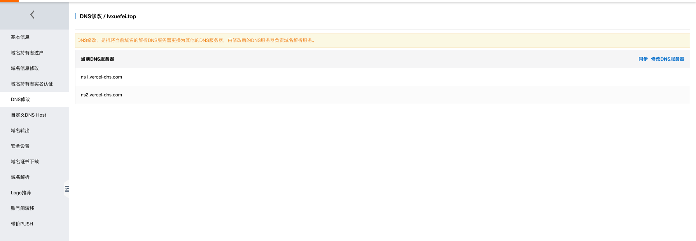
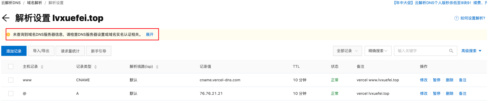
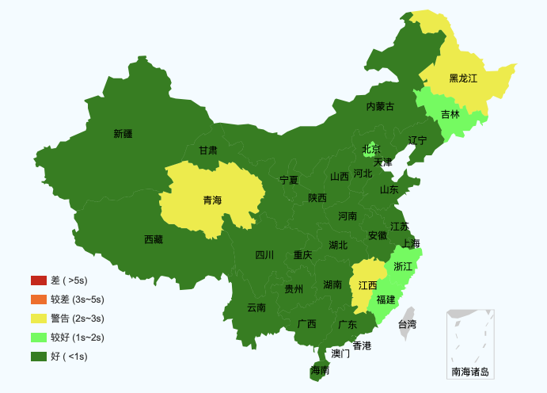

随着`GitHub Pages`在国内的访问速度越来越慢，有时甚至直接无法访问，之前一直使用的Coding加速，后来随着Coding并入腾讯云，新版Coding如果使用Pages服务需要购买腾讯云的服务，旧版Coding已经无法使用。如果不想付费的话，寻找一种新的加速手段来加速博客势在必行。

一番搜索之后，找到了一个非常好用，快速的平台——[Vercel](https://vercel.com/)。

<!--more-->

版本信息:

>* hexo-v3.9.0
>* NexT.Muse v7.4.1
# 1.Vercel是什么

这部分内容主要是记录一下我对Vercel的认识，想要直接配置的话可以直接看第二节。

下面是[Vercel官网](https://vercel.com/)给出的解释

>Vercel is a deployment and collaboration platform **for frontend developers**. Vercel puts the **frontend developer first**, giving them comprehensive tools to build high-performance websites and applications.
>
>Vercel enables developers to host websites and web services that deploy instantly and scale automatically – all without any configuration.

按我个人理解，Vercel就是一个为前端工作者提供网站托管服务的云平台。它可以很方便的从GitHub仓库中直接拉取前端项目或者从Vercel官方提供的前端模板中构建前端项目然后部署到Vercel提供的云平台上，以供公网访问，无需使用自己的服务器进行一系列的配置之后再进行部署，极大地方便了网站部署的流程。

Vercel不仅可以部署静态网站，也可以部署动态网站，动态网站的API接口可以使用Vercel提供的[Serverless](https://en.wikipedia.org/wiki/Serverless_computing)服务进行编写，不过Vercel是不提供数据库服务的，如果再使用云数据库开发项目的话，那么就可以做到无服务器部署动态网站了。

这里我还测试了一个小用途，我把自己用Vue写的一个Web前端项目`build`之后部署到了Vecel上，发现同样可以运行，并且还可以和我自己服务器上的后端API交互（不过我数据没传过来，因为提示API需要使用HTTPS，不能使用HTTP，但我的API没有配置HTTPS），也就是说，以后如果要前后端分离部署的话，甚至都不需要自己在服务器上配置nginx了，直接用Vercel就行。

因此，Vercel的用途其实是非常广泛的，用Vercel来加速个人博客只是一个用途，只是为了白嫖一下Vercel的服务器而已:-D

# 2.使用Vercel加速网站

## 2.1 导入GitHub仓库
首先需要注册一个Vercel账号，直接使用GitHub账号即可。

注册并登录之后，直接`import`自己的项目仓库。

导入GitHub项目成功后，Vercel会自动生成一个网站域名，直接点击Visit访问该域名就可以访问到自己的网站了。

## 2.2 配置域名

如果有自己的域名，可以为项目配置自定义域名。

点击View Domains，跳转到域名配置界面，输入自己的域名，点击Add，选择推荐的方式即可，推荐方式的意思是，使用`www.lvxuefei.top`作为主访问方式，如果输入了`lvxuefei.top`，则会自动跳转到`www.lvxuefei.top`。

然后根据提示，在自己的域名供应商（我的是阿里云，其他也应该大同小异）提供的域名解析控制台中，添加两条解析记录。**我的策略是：境外解析依然走`GitHub Pages`，境内解析走`Vercel`，这个在域名解析控制台进行配置即可。**（注意，因为我已经配置好了，为了展示没添加解析记录是什么样子，我用了一个lvxuefei.com的域名来测试）

这时还可能会出现配置不成功的提示，提示需要将DNS服务器改为`ns1.vercel-dns.com`   `ns2.vercel-dns.com`，阿里云默认提供的DNS服务器是`dns1.hichina.com`  `dns2.hichina.com`，在阿里云的域名管理界面修改即可。

以上都配置成功后，可能要过几分钟到十几分钟才会生效，生效时阿里云的域名解析页面是会提示已经更换了域名服务器了的，不过最后我出现了个问题，就是当我访问`lvxuefei.top`的时候，url并不会自动跳转，而是直接提示无法访问到服务器，这个问题到现在也还没解决，不过直接访问`www.lvxuefei.top`是没问题的，希望以后能找到解决方案。

加速成功后，使用[测速网站](https://www.17ce.com/site)测试网站访问速度。~~别问我下面为什么几乎全绿(∩_∩)，因为我测了好几次截了个最好的~~。

以后在`deploy`到`GitHub Pages`上时，Vercel会自动同步更新，无需单独操作，可以说是很方便了。

参考文章：

> https://sspai.com/post/63028
>
> https://zhuanlan.zhihu.com/p/347990778

