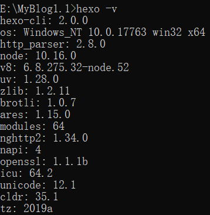
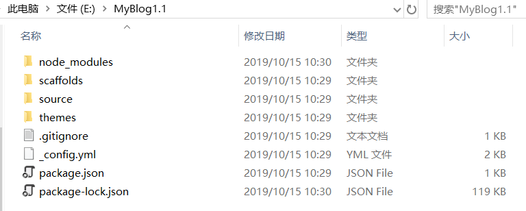
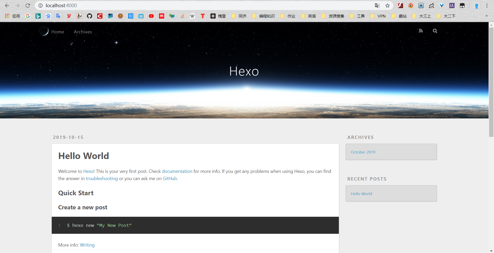
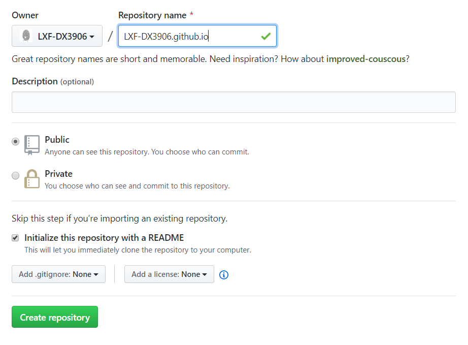
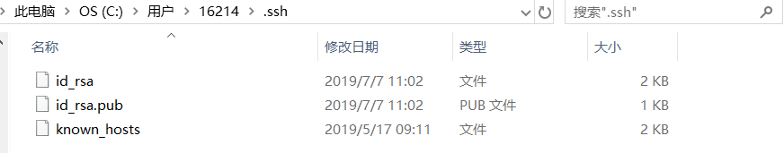

之前第一次搭博客花了两天左右，网上搜各种教程，但是各种教程对应的版本较为混乱，导致最后博客出现了一些小bug，虽然不影响使用，但是强迫症犯了X﹏X，就准备再搭一个然后把之前的博文迁移过去，写下这个系列博客以做记录吧~

<!--more-->

## 0.前提准备：

▣一个GitHub账号

▣安装Git，详情可以看[廖雪峰老师的git教程](https://www.liaoxuefeng.com/wiki/896043488029600)

▣安装Node.jshttps://nodejs.org/en/download/

▣npm包管理器

## 1.安装Hexo

新建博客文件夹，命名为MyBlog1.1

cmd打开命令行控制器，cd到MyBlog1.1文件夹下，输入

```bash
npm install i -g hexo
```

确认是否安装成功：

```bash
hexo -v
```



## 2.初始化博客

初始化博客：

```bash
hexo init
```

成功后结果如下：



▣简单解释各文件夹的作用

`node_modules`：依赖包

`scaffolds`：命令生成文章等的模板

`source`：自己推送的博文以及各种默认页面都存放在这个文件夹下

`themes`：存放Hexo的主题，我用的是Next（想要了解更多主题可以看一下知乎上的这篇回答[有哪些好看的Hexo主题](https://www.zhihu.com/question/24422335)）

`_config.yml`：整个博客的配置

`package.json`：项目所需模块项目的配置信息

▣到这一步，你已经可以有点小小的成就感回馈了，在博客目录下输入

```bash
hexo server
```

在浏览器中打开http://localhost:4000，你可以看到以下界面，这是Hexo的默认界面，想要更好看就要为它配置主题了，关于主题配置会在下面写到。



`Ctr+C`关闭服务

## 3.将博客部署到GitHub上

但是我们现在只是初步地将我们的个人博客部署到了我们的本地电脑上，只能通过localhost访问，想要将博客部署到互联网上使别人能够访问的话，还要借助github的github pages功能（当然github pages只是一个选择，还可以选择Coding等来部署我们的个人博客）。

### 3.1新建仓库

在github上新建一个名为`你的用户名.github.io`的仓库，比如说，如果你的github用户名是test，那么你就新建`test.github.io`的仓库（必须是你的用户名，其它名称无效），将来你的网站访问地址就是 [http://test.github.io](http://test.github.io/) 了。



### **3.2配置SSH Key**

之前配置过的可以跳过

查看是否已经有ssh密钥

打开用户主目录，查找.ssh文件夹



- 如果有，再看看这个目录下有没有id_rsa和id_rsa.pub这两个文件。如果有，可以直接跳至下一小节“修改配置以关联github”

- 如果已经有ssh密钥，想要重新生成ssh密钥，需要清理原有ssh密钥：

  ```bash
  mkdir key_backup
  cp id_rsa* key_backup
  rm id_rsa*
  ```

- 如果没有，打开命令行，输入命令

  ```bash
  ssh-keygen -t rsa –C “youremail@example.com”
  ```

  此处的邮箱地址为你自己的邮箱地址。一路Enter过来就好，得到信息：

  ```bash
  Your public key has been saved in /c/Users/user/.ssh/id_rsa.pub.
  ```

找到该文件，打开，复制里面的所有内容，然后进入Sign in to GitHub：https://github.com/settings/ssh

New SSH key —>Title：blog —> Key：输入刚才复制的—> Add SSH key

### 3.3修改配置以关联github

打开MyBlog1.1文件夹，打开博客配置文件`_config.yml`,修改一些基础配置（**记得冒号后必须有空格，不然配置不生效！**）

```yaml
deploy:
    type: git
    repo: https://github.com/YourgithubName/YourgithubName.github.io.git
    branch: master
```

### 3.4最后一步，上传到Github

上传到Github

- 需要先安装Hexo上传仓库的工具，执行`npm install hexo-deployer-git --save`，这样你写好的文章才能部署到github服务器。
- 执行命令（建议每次都这样做，先清除、再编译上传）

```bash
hexo clean
hexo generate
hexo deploy
```

- 在浏览器输入`http://yourgithubname.github.io`，这样你就可以看到自己的在线博客了~

参考：

> [手把手教你用Hexo搭建个人技术博客](https://juejin.im/post/5abcd2286fb9a028d66440ba)
>
> [GitHub+Hexo 搭建个人网站详细教程](https://zhuanlan.zhihu.com/p/26625249)

