搭建完一个博客的demo之后，为了让我们自己的博客变得刚好看一些，例如头像、动态背景、社交链接等等；还有功能更强大一些，例如添加搜索功能、支持`RSS`订阅、增加评论功能等等。接下来我们需要对博客进行各种自定义的设置。下面我列出了一些我做的自定义配置。

<!--more-->

**一些对NexT不是很熟的小伙伴注意：**可能在你为博客配置各种功能的时候会在网上搜到很多教程，虽然有一定的借鉴意义，但是有些已经不适配目前的版本了，一些旧版本`NexT`未集成的功能可能在新版本中集成了，但是如果仍旧依照旧版本的教程来修改配置文件或甚至`.swig`文件的话，可能会造成一些未知的bug或者冲突（不要问我怎么知道的(σ｀д′)σ），所以在搜索教程的时候要注意教程的写作时间，注意版本适配问题。当然，相信机智的你一定能解决这些问题的。

我的版本信息：

```
* hexo-v3.9.0
* NexT.Muse v7.4.1
```

## 1.界面优化

### 1.1侧栏设置

```
侧栏设置包括：侧栏位置、侧栏显示与否、文章间距等等
```

打开 **主题配置文件** 找到`sidebar`字段

```yaml
sidebar:
# Sidebar Position - 侧栏位置
  #position: left        #靠左放置
  position: right      #靠右放置
  
# 手动定义侧边栏宽度。如果注释，将默认为:
  # Muse | Mist: 320
  # Pisces | Gemini: 240
  #width: 300

# Sidebar Display - 侧栏显示时机（只对Muse | Mist两种风格有效）
  display: post        #默认行为，在文章页面（拥有目录列表）时显示
  #display: always       #在所有页面中都显示
  #display: hide        #在所有页面中都隐藏（可以手动展开）
  #display: remove      #完全移除

  offset: 12            #文章间距（只对Pisces | Gemini两种风格有效）
  
  onmobile: false       #在窄视图上启用侧边栏（只对Muse | Mist两种风格有效）

```

### 1.2头像设置

打开 **主题配置文件** 找到`Sidebar Avatar`字段

```yaml
# Sidebar Avatar
avatar:
  url: /images/header.jpg
  rounded: ture       # 是否圆形显示头像true|false
  rotated: ture       # 光标移到头像上后头像是否旋转true|false
```

替换头像：将自己想要替换的头像命名为`header.jpg`，将其放在`next\source\images`目录下，设置`url`字段为`/images/header.jpg`

### 1.3动态背景

NexT提供了两种动态背景效果，一种是`canvas-nest`几何线条效果，一种是`canvas-ribbon`彩带效果，下面提供两种效果的添加方式，可以两者选其一，也可以都选。

#### canvas-nest几何线条效果

效果如下：线条会聚集在光标附近

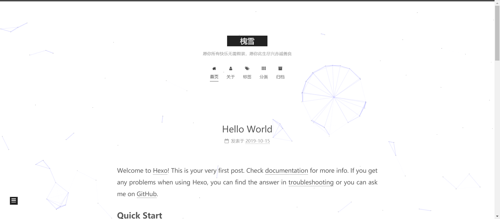

**step1：**进入到next目录下（前提：已经在MyBlog1.1目录中）

```bash
cd themes/next
```

**step2：**安装`canvas-nest`模块到 `source/lib`目录中

```bash
git clone https://github.com/theme-next/theme-next-canvas-nest source/lib/canvas-nest
```

**step3：**打开 **主题配置文件** 找到`canvas_nest`字段

```yaml
canvas_nest:
  enable: true			# 是否显示true|false
  onmobile: true 		# 是否在移动端展示true|false
  color: "120,120,120" 	# 线条的颜色（RGB表示）, 用 `,` 隔开
  opacity: 0.5 			# 线条头透明度: 0~1
  zIndex: -1 			# 用于控制线条所在层的位置, 默认:-1。值越大，显示的层面离用户越近。
  count: 150			# 线条的总条数
```

#### canvas-ribbon彩带效果

效果如下：彩带会随着鼠标点击改变

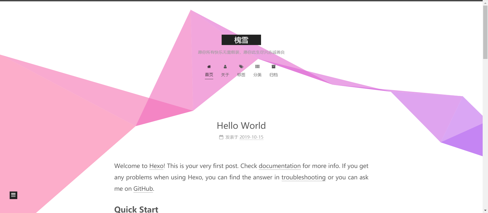


**step1：**进入到next目录下（前提：已经在MyBlog1.1目录中）

```bash
cd themes/next
```

**step2：**安装`canvas-nest`模块到 `source/lib`目录中

```bash
git clone https://github.com/theme-next/theme-next-canvas-nest source/lib/canvas-nest
```

**step3：**打开 **主题配置文件** 找到`canvas_ribbon`字段

```yaml
canvas_ribbon:
  enable: 			# 是否显示true|false
  size: 300 		# 彩带宽度
  alpha: 0.6 		# 彩带透明度
  zIndex: -1 		# 用于控制彩带所在层的位置, 默认:-1。值越大，显示的层面离用户越近。

```

### 1.4在右上角或者左上角实现fork me on github

效果如下：

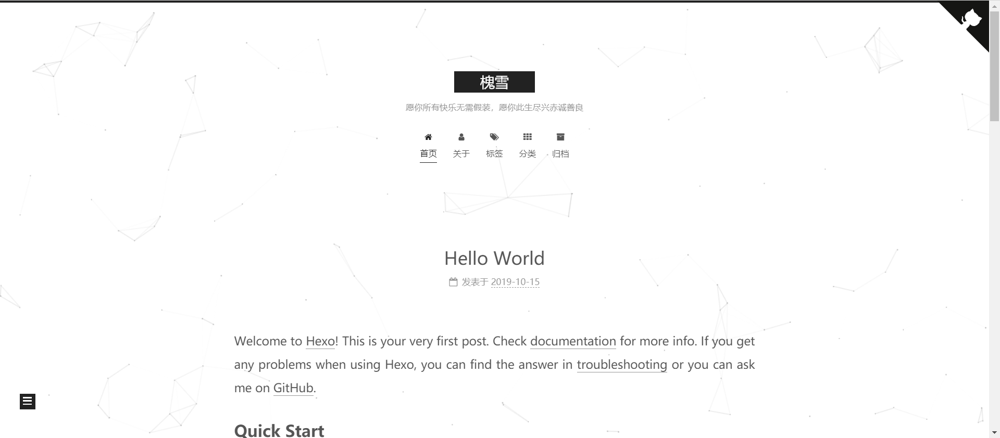

**step1：**在[GitHub Corners](http://tholman.com/github-corners/)或者[GitHub Ribbons](https://github.blog/2008-12-19-github-ribbons/)选择自己喜欢的图标，然后copy相应的代码

**step2：**将刚刚复制的代码粘贴到`themes/next/layout/_layout.swig`文件中`<div class="headband"></div>`下面一行

**step3：**把代码中的`href`后面的值替换成你要跳转的地址，比如你的GitHub主页

### 1.5显示摘要

在next的默认配置中，首页显示文章会显示全文而不是文章的摘要，这样看起来很难受，next提供了两种方法显示摘要。

#### 自动显示摘要

打开 **主题配置文件** 找到`auto_excerpt`字段

```yaml
auto_excerpt:
  enable: true     # 是否开启自动显示摘要ture|false
  length: 80	   # 摘要长度，截取文章的前n个字符
```

#### 手动控制摘要

在文章中加入`<!-- more -->` 字段，`<!-- more -->` 以前的都为文章摘要。

当两者同时使用时，`<!-- more -->`的优先级更高。

### 1.6设置网站缩略图标

在`MyBlog1.1\themes\next\source\images`文件夹下有三个文件

`apple-touch-icon-next.png`

`favicon-16x16-next.png`

`favicon-32x32-next.png`

将自己想用的图标复制成三份，按照上面三张图片的像素进行更改，并且重命名为这三个图片的名字，替换即可。

### 1.7去除hexo支持信息与主题版本信息

就是把这个去掉

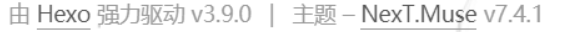

打开 **主题配置文件** 找到`powered`和`theme`字段

```yaml
powered:
    enable: false
    version: false

theme:
    enable: false
    version: false

```

### 1.8侧边栏社交信息链接

效果如下：

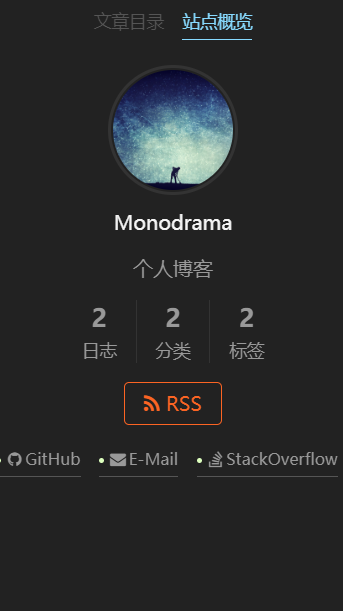

打开 **主题配置文件** 找到`social`字段，选择你想展示的社交链接

```yaml
social:
  GitHub: https://github.com/LXF-DX3906 || github
  E-Mail: mailto:xuefei_l@outlook.com || envelope
  #Weibo: https://weibo.com/yourname || weibo
  #Google: https://plus.google.com/yourname || google
  #Twitter: https://twitter.com/yourname || twitter
  #FB Page: https://www.facebook.com/yourname || facebook
  #VK Group: https://vk.com/yourname || vk
  StackOverflow: https://stackoverflow.com/users/11585996/xuefei-lv || stack-overflow
  #YouTube: https://youtube.com/yourname || youtube
  #Instagram: https://instagram.com/yourname || instagram
  #Skype: skype:yourname?call|chat || skype

```

### 1.9书签功能

会在文章的左上角或右上角生成一个标签标志，点击它可以记录我们文章阅读的进度，下次再打开时会定位到该进度位置。

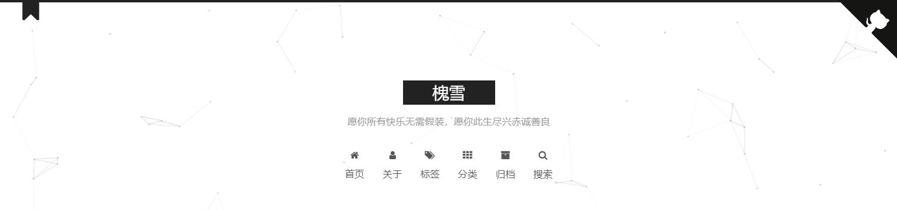

打开 **主题配置文件** 找到`bookmark`字段，将`enbale`设置为`true`

```yaml
bookmark:
  enable: 		 #是否开启书签功能true|false
  color: "#222"	 # 自定义书签颜色
  # 如果save的值为auto，在关闭页面和点击书签时都会保存进度
  # 如果save的值为manual, 只有在点击书签时会保存进度
  save: manual
```

### 1.10添加文章权利声明

在看一些博客的时候，你会发现有的文章下面会有这样的权利声明， Creative Commons 4.0国际许可证包括`by`，`by-nc`，`by-nc-nd`，`by-nc-sa`，`by-nd`，`by-sa`，`zero`等。这些许可允许创作者告知他们保留哪些权利，以及他们为了接收者或其他创作者的利益而放弃哪些权利。

虽然还没接触到这些，但是加上去总要显得正式些\^o\^y。

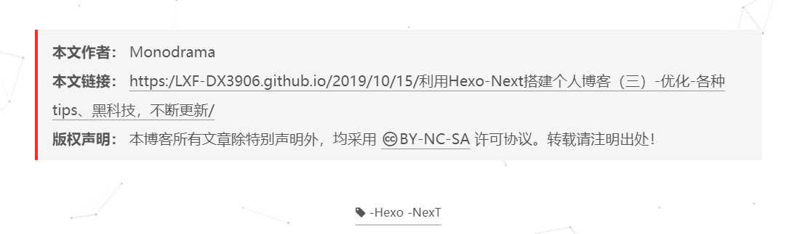

`NexT`提供了这样的功能，允许我们在文章下方和侧边栏加上权利声明，可以在**主题配置文件**中设置：

找到`creative_commons`字段

```yaml
creative_commons:
  license: by-nc-sa  #权利声明的类型by | by-nc | by-nc-nd | by-nc-sa | by-nd | by-sa | zero
  sidebar: false     #是否在侧边栏显示
  post: true		 #是否在文章下方显示
  language:
```

### 1.11更改代码块样式以及添加复制按钮

如果觉得文章中的代码块的样式不太好看的话`NexT`提供了多种代码块的样式可供选择，具体设置方法如下：

打开 **主题配置文件** 找到`codeblock`字段，根据提示选择想要的代码块样式，代码块的样式可以分为两部分，一个是代码`highlight`，另一个是代码块`style`，具体什么样可以自行设置下看看

```yaml
codeblock:
  # 代码高亮主题
  # 可供选择的值: normal | night | night eighties | night blue | night bright | solarized | solarized dark | galactic 
  # 具体信息可参照: https://github.com/chriskempson/tomorrow-theme 该网站上提供了一部分代码样式的展示图片，还有一部分没有，可以自行设定一下试试看
  highlight_theme: normal
  # 在代码块上增加复制代码按钮
  copy_button:
    enable: true
    # 是否展示复制结果
    show_result: false
    # 代码块的样式: default | flat | mac
    style: mac
```

### 1.12网页加载时进度条

`NexT`提供了网页加载进度条功能，网页加载时在顶部显示加载进度条，有多种样式可供选择。

**step1：**定位到`themes/next`目录下

```bash
cd themes/next
```

**step2：**安装`theme-next-pace`插件

```bash
git clone https://github.com/theme-next/theme-next-pace source/lib/pace
```

**step3：**打开 **主题配置文件** 找到`pace`字段

```yaml
pace:
  enable: true  #是否开启加载进度条
  # 进度条样式:可在 https://github.hubspot.com/pace/docs/welcome/ 查看
  # big-counter | bounce | barber-shop | center-atom | center-circle | center-radar | center-simple
  # corner-indicator | fill-left | flat-top | flash | loading-bar | mac-osx | material | minimal
  theme: minimal
```

### 1.13添加3D动态背景

`NexT`提供了3D动态背景功能，有多种样式可供选择，我尝试设置了一下，酷炫是酷炫，但是有点影响阅读了，所以又关了，不过还是把过程记录下来吧，有需要的小伙伴也可以设置下。

**step1：**定位到`themes/next`目录下

```bash
cd themes/next
```

**step2：**安装`theme-next-three`插件

```bash
git clone https://github.com/theme-next/theme-next-three source/lib/pace
```

**step3：**打开 **主题配置文件** 找到`three`字段，有三种样式可以开启

```yaml
three:
  enable: true
  three_waves: false
  canvas_lines: false
  canvas_sphere: false
```

### 1.14文章结尾添加结束标记

**step1：**在目录 `themes/next/layout/_macro/` 下添加 `passage-end-tag.swig` ，内容如下：

```html
<div>    
	        
		<div style="text-align:center;color: #ccc;font-size:14px;">------ 本文结束------		</div>    
	
</div>
```

**step2：**打开 `themes/next/layout/_macro/post.swig` 文件，在`END POST BODY`字段前新增内容如下:

```html
<div>    
	
    	    
     
</div>
```

**step3：**打开`主题配置文件` ，在`Post Setting`字段下添加代码如下：

```yaml
# 文章末尾添加“本文结束”标记
passage_end_tag:
	enabled: true
```

### **1.15修改小型代码块颜色**

 修改`\themes\next\source\css\ _variables\base.styl`文件, 加入自定义颜色: 

```stylus
$whitesmoke   = #f5f5f5;
$gainsboro    = #eee;
$gray-lighter = #ddd;
$grey-light   = #ccc;
$grey         = #bbb;
$grey-dark    = #999;
$grey-dim     = #666;
$black-light  = #555;
$black-dim    = #333;
$black-deep   = #222;
$red          = #ff2a2a;
$blue-bright  = #87daff;
$blue         = #0684bd;
$blue-deep    = #262a30;
$orange       = #fc6423;
//下面是我自定义的颜色
$my-codeblock-foreground = #9966FF     // 用``围出的代码块字体颜色
$my-codeblock-background = #f5f5f5;    // 用``围出的代码块字体颜色
```

修改`$code-background`和`$code-foreground`的值:

```stylus
 // Code & Code Blocks // 用``围出的代码块 
 // -------------------------------------------------- 
$code-font-family               = $font-family-monospace 
$code-font-size                 = 15px 
$code-background                = $my-codeblock-background 
$code-foreground                = $my-codeblock-foreground 
$code-border-radius             = 4px
```

### 1.16添加看板娘

**step1：**安装`hexo-helper-live2d`模块

```bash
npm install --save hexo-helper-live2d
```

**step2：**安装`live2d-widget-model-hijiki`模块（该模块只是其中的一个模型，更多模型请在[此处]( https://github.com/xiazeyu/live2d-widget-models )查看详细信息，选择自己喜欢的模型进行安装，模型样式可在[此处]( https://huaji8.top/post/live2d-plugin-2.0/ )查看）

```bash
npm install live2d-widget-model-hijiki --save
```

**step3：**打开**站点配置文件**，在最后加上如下代码：在use字段选择自己喜欢的模型

```yaml
live2d:
 enable: true                             # 开启Live2D
 scriptFrom: local                        # 插件来源
 pluginRootPath: live2dw/                 # 插件根目录(相对路径)
 pluginJsPath: lib/                       # 脚本文件路径(相对于插件根目录路径)
 pluginModelPath: assets/                 # 模型文件路径(相对于插件根目录)
 tagMode: false                           # 是否标签模式
 debug: false                             # 是否开启调试模式
 model:
  use: live2d-widget-model-hijiki        # 选择模型
 display:
  position: left                        # 模型在页面上的位置
  width: 200                             # 模型宽度
  height: 400                            # 模型高度
 mobile:
  show: true                             # 是否在手机端显示
 react:
  opacity: 0.8                             # 设置模型透明度
```


## 2.功能优化

### 2.1添加本地搜索功能

**step1：**安装 [hexo-generator-searchdb](https://links.jianshu.com/go?to=https%3A%2F%2Fgithub.com%2Fflashlab%2Fhexo-generator-search) 插件

```bash
npm install hexo-generator-searchdb --save
```

**step2：**打开 **站点配置文件** 找到`Extensions`在下面添加

```yaml
# 搜索
search:
  path: search.xml
  field: post
  format: html
  limit: 10000
```

**step3：**打开 **主题配置文件** 找到`Local search`，将`enable`设置为`true`

```yaml
local_search:
  enable: true
  trigger: auto				# trigger若为auto, 通过改变输入触发搜索
  							# trigger若为manual, 通过按下enter键或者点击搜索按钮触发搜索
  top_n_per_article: 1 		# 展示每篇文章的前n个结果，如果想要展示所有结果，设置为-1
  unescape: false			# 将html字符串转义为可读的字符串。
  preload: false			# 当加载页面时预加载搜索结果
```

### 2.2添加站点访问计数

next提供了多种访问计数的方式，在这里我们选择使用[不蒜子](https://links.jianshu.com/go?to=http%3A%2F%2Fbusuanzi.ibruce.info)

打开 **主题配置文件** 找到`busuanzi_count`字段，将`enbale`设置为`true`

```yaml
busuanzi_count:
  enable: true                #是否显示计数ture|false
  total_visitors: true		  #访客数，uv的方式，单个用户连续点击n篇文章，只记录1次访客数
  total_visitors_icon: user
  total_views: true           #访问量，pv的方式，单个用户连续点击n篇文章，记录n次访问量
  total_views_icon: eye
  post_views: true            #是否显示每篇文章的访问次数ture|false
  post_views_icon: eye
```

网站访问次数

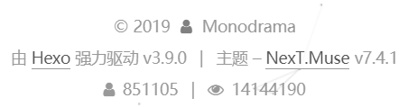

文章显示次数

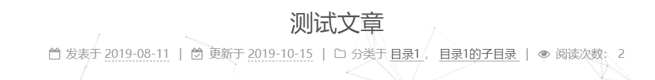

还可以将小人与眼睛的图标改成如下效果

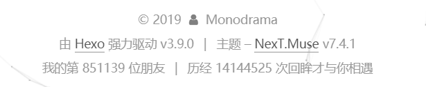

打开`themes\next\layout\_partials\analytics\busuanzi-counter.swig`

更改如下两段代码

```html
<span class="post-meta-item" id="busuanzi_container_site_uv" style="display: none;">
      <!--<span class="post-meta-item-icon">-->
        <!--<i class="fa fa-{{ theme.busuanzi_count.total_visitors_icon }}"></i>-->
      <!--</span>-->
	  我的第
      <span class="site-uv" title="{{ __('footer.total_visitors') }}">
        <span id="busuanzi_value_site_uv"></span>
      </span>
	  位朋友
    </span>

```

```html
<span class="post-meta-item" id="busuanzi_container_site_pv" style="display: none;">
      <!--<span class="post-meta-item-icon">-->
        <!--<i class="fa fa-{{ theme.busuanzi_count.total_views_icon }}"></i>-->
      <!--</span>-->
	  历经
      <span class="site-pv" title="{{ __('footer.total_views') }}">
        <span id="busuanzi_value_site_pv"></span>
      </span>
	  次回眸才与你相遇
    </span>
```

### 2.3添加网站字数统计

安装`hexo-symbols-count-time`模块

```bash
npm install hexo-symbols-count-time
```

打开 **主题配置文件** 找到`symbols-count-time`字段

```yaml
symbols_count_time:
  separated_meta: true
  item_text_post: true
  item_text_total: true
  awl: 4
  wpm: 275
```

### 2.4添加RSS订阅

有关什么是RSS的知识可以参考这篇文章[如何用RSS订阅？](https://juejin.im/post/5c382a326fb9a049f15469eb)

**step1：**安装`hexo-generator-feed`插件

```bash
npm install hexo-generator-feed --save
```

**step2：**在**站点配置文件**的`Extensions`字段下添加配置

```yaml
# RSS功能
feed:
    type: atom
    path: atom.xml
    limit: 20
```

执行`hexo generator`命令在 `public` 文件夹中生成 `atom.xml` 文件

配置含义：

- `type`: RSS的类型(atom/rss2)
- `path`: 文件路径，默认是 atom.xml/rss2.xml
- `limit`: 展示文章的数量,使用 0 或则 false 代表展示全所有的帖子
- `hub`: URL of the PubSubHubbub hubs (如果使用不到可以为空)
- `content`: （可选）设置 `true` 可以在 RSS 文件中包含文章全部内容，默认：false
- `content_limit`: （可选）摘要中使用的帖子内容的默认长度。 仅在内容设置为false且未显示自定义帖子描述时才使用。
- `content_limit_delim`: （可选）If content_limit is used to shorten post contents, only cut at the last occurrence of this delimiter before reaching the character limit. Not used by default.
- `order_by`: 订阅内容的顺序. (默认: -date)
  （后面几个选项一般用不到，有两个也没找到比较准确的翻译，所以放上了原文，知道的小伙伴可以在下方评论）

**step3：**打开 **主题配置文件** 找到`rss`字段，添加值`"atom.xml"`

```yaml
rss: "atom.xml"
```

在菜单栏会生成RSS按钮

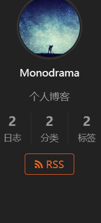

### 2.5添加评论功能

之前使用过多种评论插件，从gitalk到livere（来必力），不过最后选择了`Valine`。

 `Valine` 诞生于2017年8月7日，最初由`@云淡风轻`大佬开发（这里附上[原文链接]( https://ioliu.cn/2017/add-valine-comments-to-your-blog/ )），后又经过许多大佬的开发和维护，是一款基于[LeanCloud](https://leancloud.cn/)的快速、简洁且高效的无后端评论系统。 

**step1：**注册[LeanCloud](https://leancloud.cn/)并创建一个开发版应用（免费）

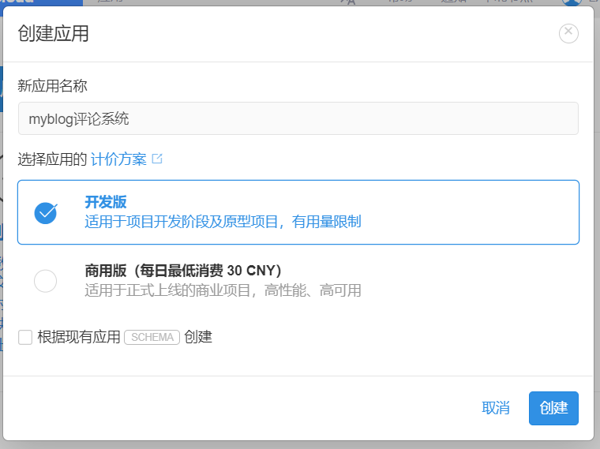

**step2：**在LeanCloud -> 存储 -> 创建Class -> 无限制的Class

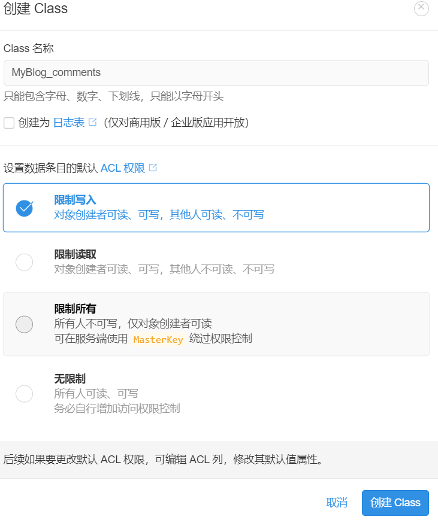

**step3：**在LeanCloud-设置-把除数据存储其他选项都关闭。

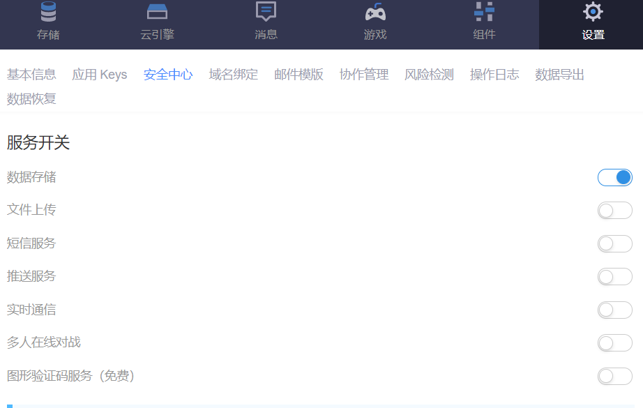

**step4：**设置安全域名

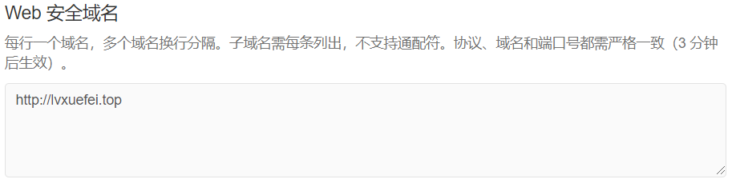

**step5：**打开 **主题配置文件** ，配置文件中有两处`Valine`字段，它们分别如下所示

●这里的`valine`字段是填写`valine`脚本的源文件地址，可在[此处]( https://www.jsdelivr.com/package/npm/valine )查看最新的`valine`脚本地址，将其链接复制下来填入到`valine`字段之后即可

```yaml
# Valine
  # Example:
  # valine: //cdn.jsdelivr.net/npm/valine@1/dist/Valine.min.js
  # valine: //cdnjs.cloudflare.com/ajax/libs/valine/1.3.4/Valine.min.js
  valine: https://cdn.jsdelivr.net/npm/valine@1.3.10/dist/Valine.min.js
```

●这里的`valine`字段是用来配置评论系统的，填写`appid`和`appkey`（在LeanCloud的设置->应用Keys中），其他字段可以根据提示自行配置，下面是我的配置。

```yaml
# Valine.
# You can get your appid and appkey from https://leancloud.cn
# more info please open https://valine.js.org
valine:
  enable: true # 为true时启用评论 
  appid:  # your leancloud application appid 注意空一格再输入ID和key,这里填写上面得到的APP ID
  appkey:  # your leancloud application appkey 这里填写上面得到的APP KEY
  notify: false # mail notifier , https://github.com/xCss/Valine/wiki 是否开启新评论邮件通知
  verify: false # Verification code 验证码
  placeholder: 你的言论将上交国家,请注意文明用言,否则可能被拒收或查水表 ヾﾉ≧∀≦)o 来呀！吐槽一番吧！
  				# 评论框中预设的文字,随意填写
  avatar: mm 	# gravatar style 头像,采用gravatar头像,到http://cn.gravatar.com/了解
  guest_info: nick,mail,link # 访客信息,显示在评论框上面,三者可随意选择或全选
  pageSize: 10 # pagination size 评论分页大小

```

### 2.6相关文章推荐

`NexT`提供了相关文章推荐的功能，是借助`hexo-related-popular-posts`模块实现的，具体细节可以查看该模块的[GitHub地址]( https://github.com/tea3/hexo-related-popular-posts) ，`hexo-related-popular-posts`模块可以实现`相关文章推荐`和`热门文章`的功能，我觉得自己的博客应该没有设置热门文章功能的必要hhh，所以只配置了相关文章推荐的功能。

效果展示：（会在根据博文的标签来匹配相关文章，在博文的下方生成相关文章列表）

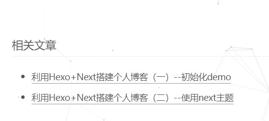

**step1：**打开控制台，定位到博客主目录，安装`quicklink`模块：

```bash
npm install hexo-related-popular-posts --save
```

**step2：**打开**主题配置文件**，找到`related_posts`字段，将`enable`设置为`true`，其他值采用默认即可。

```yaml
related_posts:
  enable: true  #是否开启相关文章功能true|false
  title: # 相关文章板块的标题，如上图为相关文章，可以自定义（如：这边还有相似的文章哟ˋ( ° ▽、° ) ），默认为“相关文章”
  display_in_home: false  #是否在首页展示每篇博文的相关文章，会在摘要下方显示
  params:                 
    maxCount: 5			  #相关文章最多展示条数
```

### 2.7快速连接技术

什么是快速连接技术，下面是其[GitHub源地址]( https://github.com/GoogleChromeLabs/quicklink )上给出的解释：

> 通过在空闲时间预取视区内链接来加快后续页面加载速度 

按我的理解应该是在我们访问博文页面的时候，如果博文位于视区内的部分有网页链接，那么浏览器在空闲时会预加载该链接对应的页面以达到加快后续的访问速度的目的。

**step1：**打开控制台，定位到博客主目录，安装`quicklink`模块：

```bash
npm install --save quicklink
```

**step2：**打开**主题配置文件**，找到`quicklink`字段，将`enable`设置为`true`，其他值采用默认即可。

```yaml
quicklink:
  enable: true
```


最后附上一篇大佬的文章[基于Hexo搭建个人博客——进阶篇(从入门到入土)]( https://yangbingdong.com/2017/build-blog-hexo-advanced/ )