Hexo有很多主题可供选择，想要了解详细内容可以看一下知乎上的这个问题[有哪些好看的Hexo主题](https://www.zhihu.com/question/24422335)

最终我选择了next。

<!--more-->

## 1.下载next主题

访问[next的github地址](https://github.com/theme-next/hexo-theme-next)，Clone or Download，将next的压缩包下载下来。

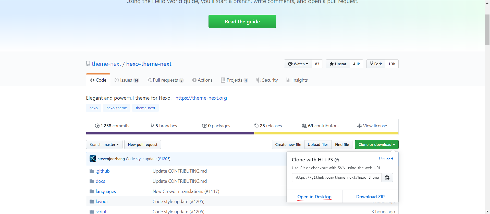

将压缩包解压到博客目录MyBlog1.1(我的博客目录的名称)下的themes文件夹中，并将其重命名为next

## 2.配置next主题

首先进行一下文件说明，在 `Hexo` 项目源码目录下，有两个主要的配置文件，其名称都是 `_config.yml` 。 其中，一份位于站点根目录下，主要包含 `Hexo` 本身的配置；另一份位于`themes\next`目录下，这份配置由主题作者提供，主要用于主题相关的配置。为了描述方便，在以下说明中，将前者称为**站点配置文件**， 后者称为**主题配置文件**。

### 2.1修改站点配置文件

打开`MyBlog1.1/`目录下的**站点配置文件**`_config.yml`：

前期可以先只更改一处内容，把标题、子标题、作者等自定义一下，其他的可以以后有时间研究，例如我的

```yaml
title: 槐雪
subtitle: 愿你所有快乐无需假装，愿你此生尽兴赤诚善良
description: 个人博客
keywords:
author: Monodrama
language: zh-CN
timezone: Asia/Shanghai
```

关于站点配置文件的详细说明，可以查看 [Hexo站点配置文件说明](http://lvxuefei.top/2019/10/17/Hexo%E7%AB%99%E7%82%B9%E9%85%8D%E7%BD%AE%E6%96%87%E4%BB%B6%E8%AF%B4%E6%98%8E/#more )

### 2.2修改主题配置文件

打开`MyBlog1.1\themes\next`目录下的`_config.yml`**主题配置文件**

#### 选择scheme

Next提供了四种不同的外观，在**主题配置文件**中找到Scheme Setting，根据个人喜好选择scheme

```yaml
# ---------------------------------------------------------------
# Scheme Settings
# ---------------------------------------------------------------

# Schemes
#scheme: Muse
#scheme: Mist
#scheme: Pisces
scheme: Gemini
```

**Muse：**

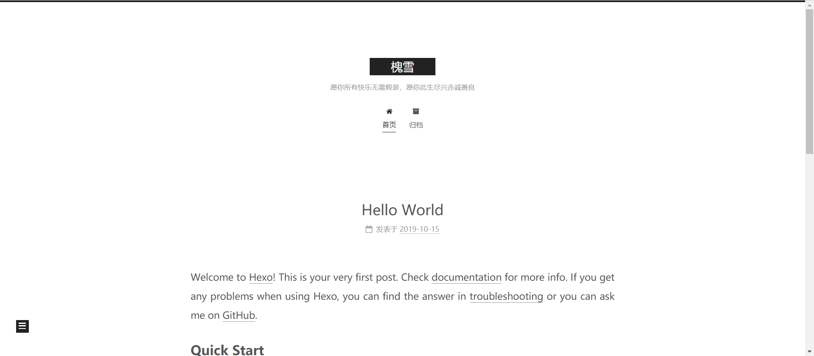


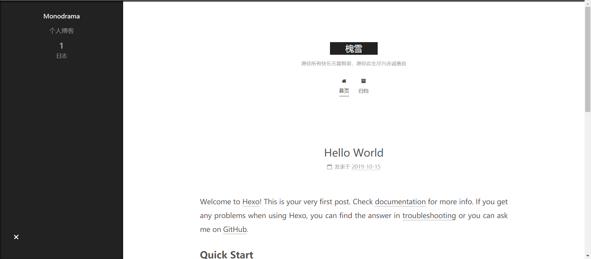

**Mist：**

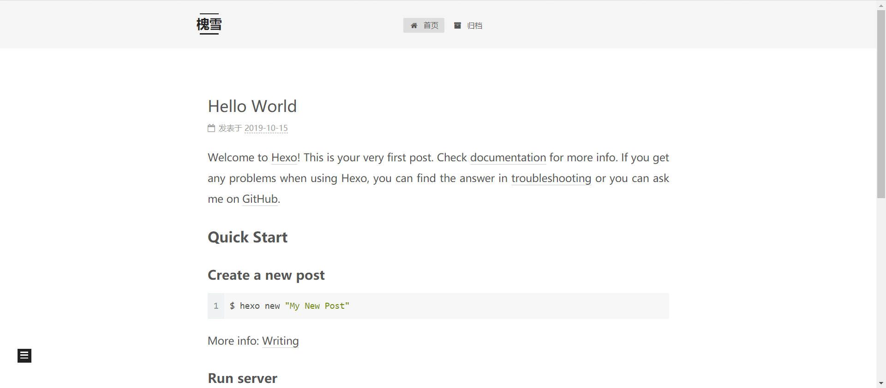


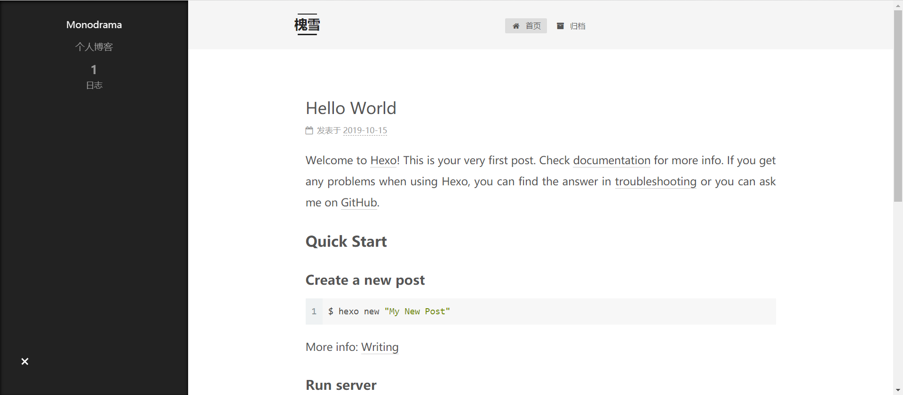

**Pisces：**

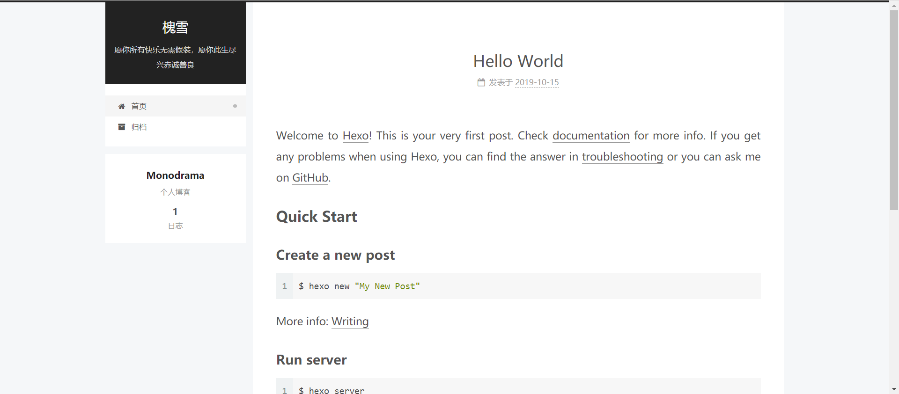

**Gemini：**

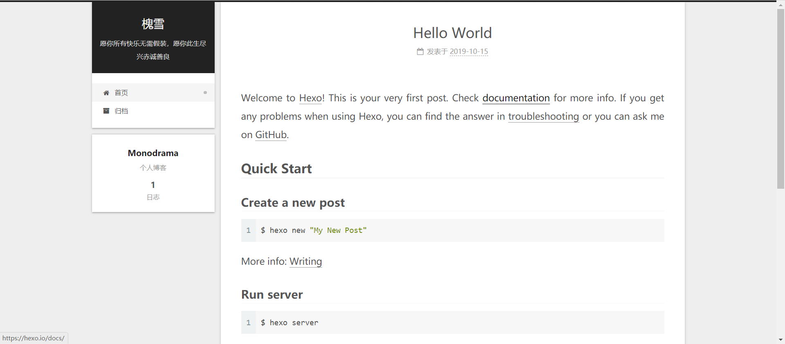

#### 设置菜单

```
菜单包括：首页、归档、分类、标签、关于等等
```

我们刚开始默认的菜单只有首页和归档两个，不能够满足我们的要求。

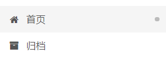

所以需要添加菜单，打开 **主题配置文件** 找到`Menu Settings`，根据个人需要选择，将前面的#去掉即可

```yaml
# ---------------------------------------------------------------
# Menu Settings
# ---------------------------------------------------------------

menu:
  home: / || home                      #首页
  #about: /about/ || user              #关于
  #tags: /tags/ || tags                #标签
  #categories: /categories/ || th	   #分类
  archives: /archives/ || archive      #归档
  #schedule: /schedule/ || calendar	   #日程表
  #sitemap: /sitemap.xml || sitemap    #站点地图
  #commonweal: /404/ || heartbeat      #公益404
```

**初始化对应的Menu文件夹**

去掉#后，还要初始化每个菜单项对应的页面的内容

比如要创建tages页面，需要在命令行中输入

```bash
hexo new page "tags"
```

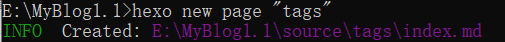

这时会在`MyBlog1.1\source\`目录下生成一个名为tags的文件夹

编辑/source/tags/index.md文件为

```yaml
title: tags
date: 2019-10-05 16:02:39
type: "tags"
comments: false
```

增加对应的type字段，其中`comments`字段是控制评论功能的，关于添加评论功能会在后面讲到。

其他页面同理。

其中，tags、archives与categories等动态生成的页面会随着我们博文的更新而不断增加内容。

假入我写了一篇博文，给它加了一个名为tag_demo的标签，那么在tags页就会自动增加tag_demo这个标签，有关如何推送博文以及博文的格式会在后文**创建一篇文章中**讲到。

再者就是about等需要我们自定义的页面，打开`MyBlog.1.1\source\about\index.md`

添加自定义内容

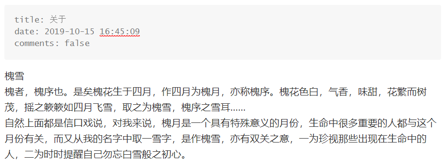

至此，我们已经拥有了一个简单实用的个人博客了，下面介绍如何发博文。

## 3.创建一篇文章

执行命令创建一篇文章

```bash
hexo new '测试文章'
```

我们发现在`MyBlog1.1\source\_posts\`目录下生成了测试文章.md。

看到.md后缀应该可以知道hexo的文章支持markdown语法，至于markdown语法是什么就不再赘述，可以借助搜索引擎自行学习。

编辑测试文章.md的内容为：

```yaml
---
title: 测试文章
date: 2019-08-11 23:06:42
tags: 
  - 标签1
  - 标签2
categories:
  - 目录1
  - 目录1的子目录
photo: http://ww1.sinaimg.cn/large/007oltUXgy1g5egxq0hrhj33282ao7wj.jpg
---
这是摘要
<!-- more -->
以下是正文
# 标题1
1
## 标题2
2
```

简单介绍一下文章前面的配置字段：

其中`tags`为文章标签，格式如上，标签之间为并列关系，如下：

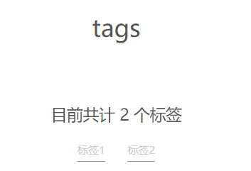

`catagories`为文章目录，格式如上，目录之间为包含关系，下面的目录是上面的目录的子目录，如下：

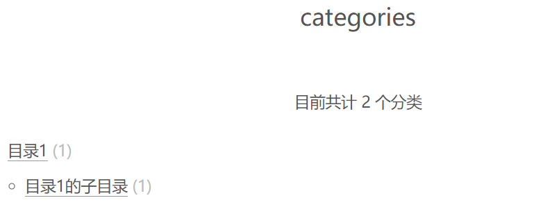

`photo`为文章的封面，是可选字段，加入之后会在首页中展示该篇文章的封面，不加入则只会显示文章摘要。

`<!--more-->`字段之前为文章摘要，会在首页中显示。

通过命令

```bash
hexo deploy
```

发布文章。

不过每次发布前，建议先执行`hexo clean`和`hexo generate`进行清理编译。

发布后可在`http://yourgithubname.github.io`上查看。