# 1.使用说明

## 1.1项目简介

参照微软cotana的工作方式，编写自己的一个python语音助手程序，借助PyQt5和Pipy，创建可视化窗口，能实现基本的语音识别功能，同时根据几个特定的关键词执行简单的行动（如music，readme等）。

## 1.2项目功能要求

●实现语音识别，并将识别的内容在屏幕上打印出来

●设置几个命令关键词（music，readme），并实现相应的行动。若识别出的内容中包含设置的几个关键词，则程序执行相应的行动。

●设置两种识别模式：PocketSphinx中包含7个Recognizer API：程序中使用了两个API：recognize_sphinx和recognize_google。（两种识别模式可由用户自行选择，其中recognize_sphinx可直接在本地运行，但识别精度较低；recognize_google识别精度较高，但是使用recognize_google需要处于联网状态下且IP地址需要在境外，否则语音识别会出现错误）

●设置文本框：用户可直接在文本框中输入命令，其执行效力与语音输入等效。

## 1.3操作手册


### 1.3.1整体界面

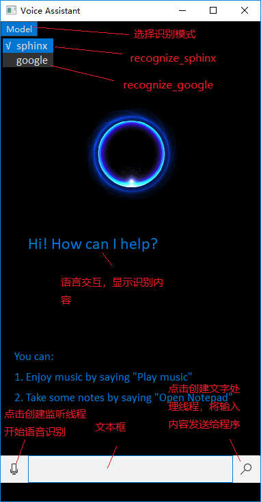

### 1.3.2开始声音识别

点击图中红框内按钮，程序创建监听线程

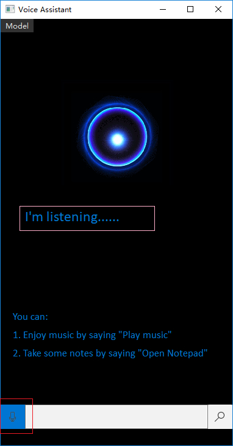

识别过程中，程序显示：I‘m listening......

语音输入结束后，程序显示识别内容：

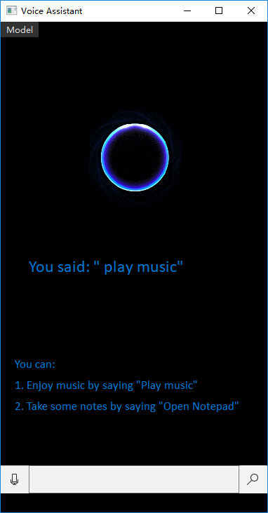

执行music命令：

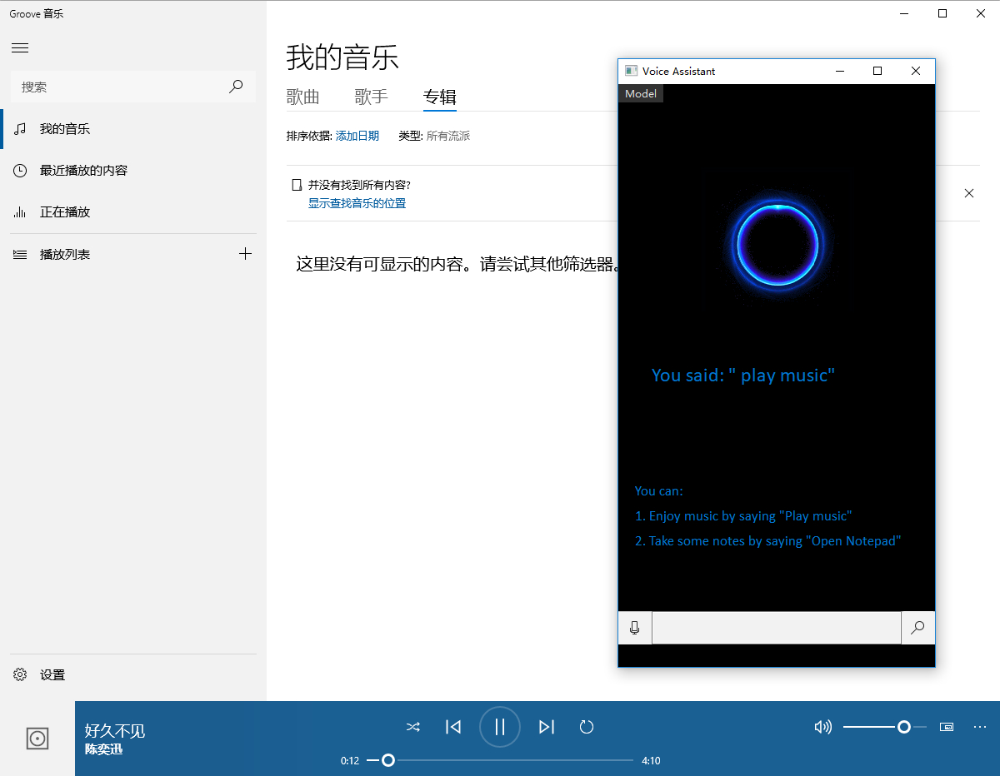

### 1.3.3选择声音识别模式

在菜单栏选择识别模式，√说明该模式被选择。

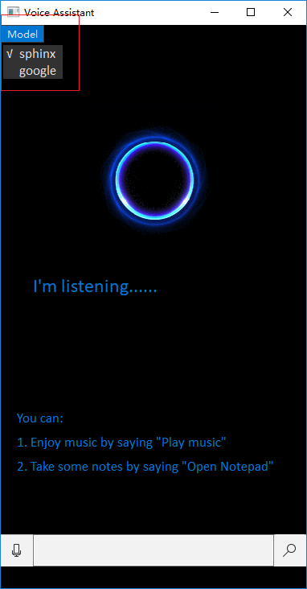

### 1.3.4文本输入

在文本框输入文本内容，点击右侧按钮确认输入。

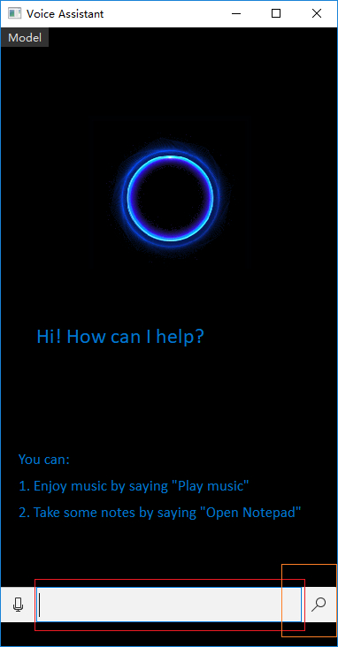

系统显示输入结果：

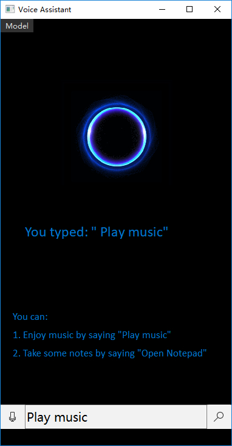

执行music命令：


# 2.程序设计与实现

## 2.1设计

### 类设计：

```python
class Ui_MainWindow(object):
```

Ui_Mainwindow类加载图形化用户界面，控制界面布局，类中包含各种Label，PushButton，MenuBar控件。

```python
class myWindow(QtWidgets.QMainWindow):
```

mywindow类处理交互逻辑，类中包含各种执行函数，同时实现控件与函数的连接。

## 2.2实现

### 主要函数实现：

#### ①声音监听与处理函数

```python
def listen(self):
    # Working with Microphones
    mic = sr.Recognizer()
    with sr.Microphone() as source:  # use the default microphone as the audio source
        audio = mic.listen(source)  # listen for the first phrase and extract it into audio data
    try:
        if self.isgoogle:
            content = mic.recognize_google(audio)
        else:
            content = mic.recognize_sphinx(audio)
    except sr.RequestError:
        self.ui.label.setText("Something was wrong! Try again......")

    COMMEND = ["music", "open"]
    commend_is_music = re.search(COMMEND[0].lower(), content.lower())
    commend_is_file = re.search(COMMEND[1].lower(), content.lower())
    if commend_is_music:
        self.ui.label.setText("you said: /" " + content + "/"")
        win32api.ShellExecute(0, 'open', 'D://网易云音乐//CloudMusic//cloudmusic.exe', '', '', 1)
    elif commend_is_file:
        self.ui.label.setText("you said: /"" + content + "/"")
        win32api.ShellExecute(0, 'open', 'D://Notpad++//Notepad++//notepad++.exe', '', '', 0)
    else:
        self.ui.label.setText("you said: /" " + content + "/"/nIt's not a valid command.")
```

#### ②创建监听线程

```python
def listen_thread(self):
    self.ui.label.setText("I'm listening...... ")
    t1 = threading.Thread(target=self.listen)
    t1.setDaemon(True)
    t1.start()
```

#### ③文本处理函数

```python
def text_changed(self):
    content = self.ui.textbox.text()
    print(content)
    COMMEND = ["music", "open"]
    commend_is_music = re.search(COMMEND[0].lower(), content.lower())
    commend_is_file = re.search(COMMEND[1].lower(), content.lower())
    if commend_is_music:
        self.ui.label.setText("you typed: /" " + content + "/"")
        win32api.ShellExecute(0, 'open', 'D://网易云音乐//CloudMusic//cloudmusic.exe', '', '', 1)
    elif commend_is_file:
        self.ui.label.setText("you typed: /"" + content + "/"")
        win32api.ShellExecute(0, 'open', 'D://Notpad++//Notepad++//notepad++.exe', '', '', 0)
    else:
        self.ui.label.setText("you typed: /" " + content + "/"/nIt's not a valid command.")
```


#### ④创建文本处理线程

```python
def text_thread(self):
    t2 = threading.Thread(target=self.text_changed)
    t2.setDaemon(True)
    t2.start()
```

#### ⑤连接各类控件与相应函数

```python
self.ui.recognize_btn.clicked.connect(self.listen_thread)#语音识别按钮连接监听线程
self.ui.sphinx_bar.triggered.connect(self.sphinxbar_recognize)#sphinx模式触发
self.ui.google_bar.triggered.connect(self.googlebar_recognize)#google模式触发
self.ui.text_btn.clicked.connect(self.text_thread)#文本框输入确认按钮连接文本处理线程
```

# 3.测试

## 3.1语音输入

测试用例：hello

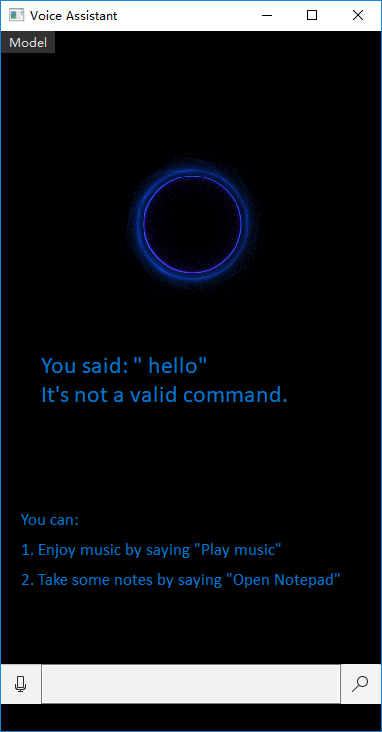

测试用例：music

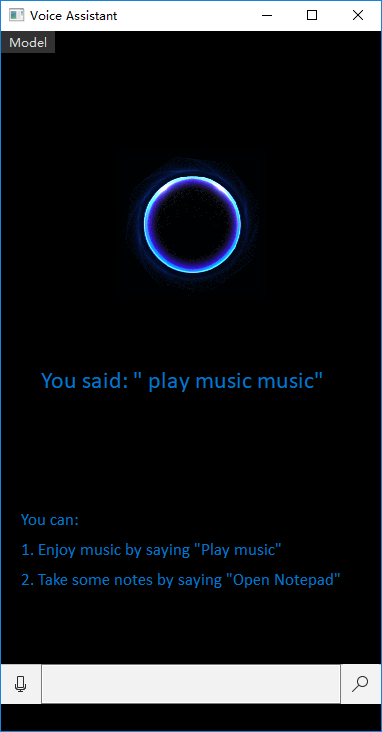


测试用例：open readme file

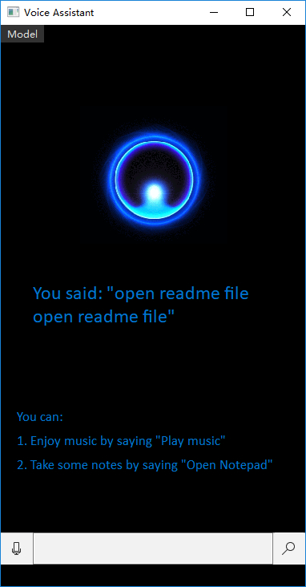

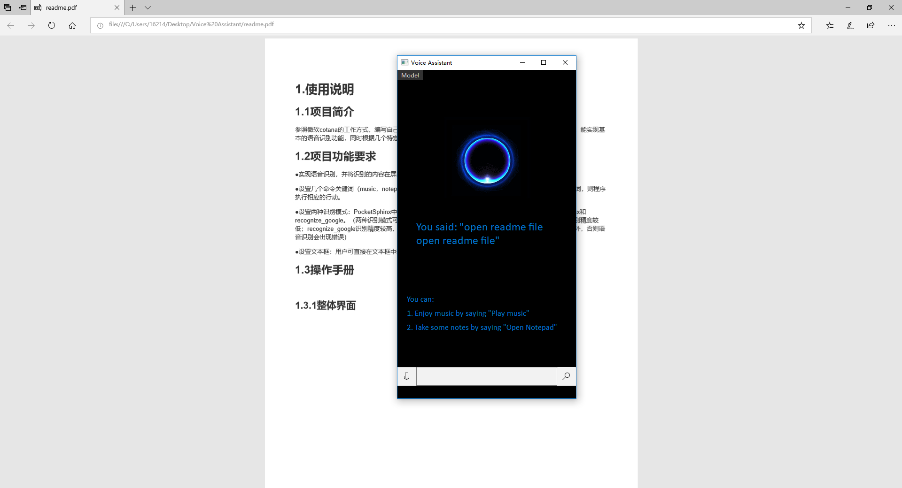

## 3.2文本输入

测试用例：hello

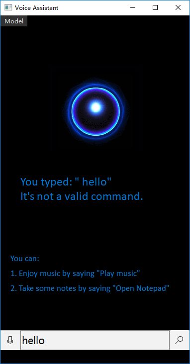

测试用例：music

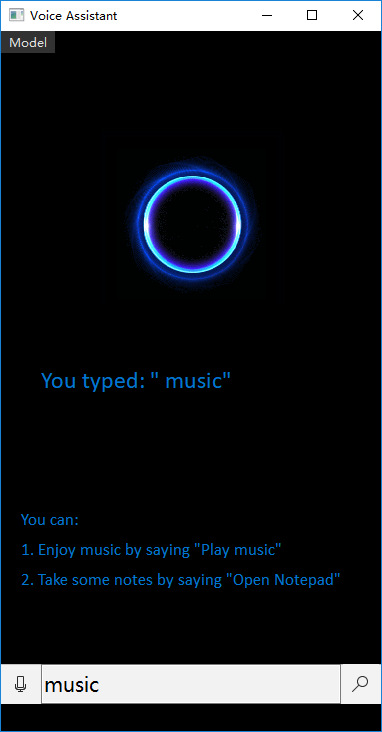

测试用例：open readme file

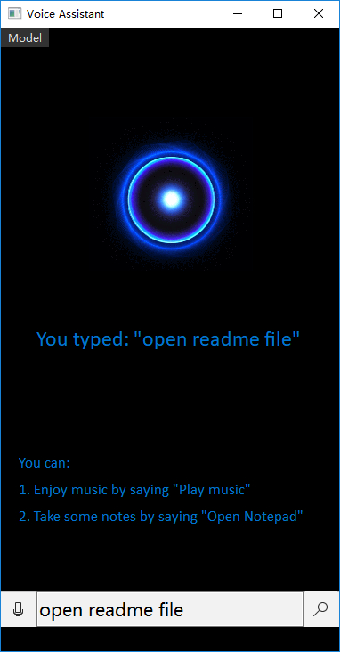

# 4.简单出错处理

若IP地址在境内时选择了google的API进行识别，则程序会提示错误。

如图所示

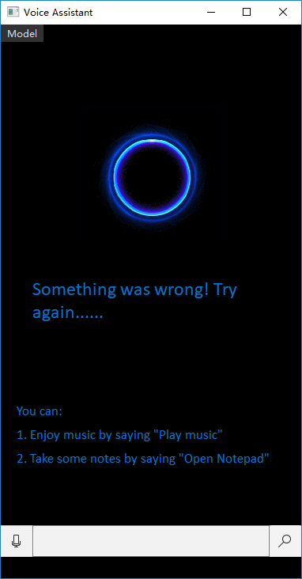

# 5.识别准确性分析

## 5.1准确性分析

recognize_sphinx（）可与CMU Sphinx 引擎脱机工作，即无需联网，可实现本地识别，但其准确性较差，经实际使用发现，很多简单命令都需要进行多次尝试才能识别出来。

经查阅资料知道：PocketSphinx是一个计算量和体积都很小的嵌入式语音识别引擎。在Sphinx-2（Sphinx-2: 采用半连续隐含马尔可夫模型（SCHMM）建模，采用的技术相对落后，使得识别精度要低于其它的译码器。

）的基础上针对嵌入式系统的需求修改、优化而来，是第一个开源面向嵌入式的中等词汇量连续语音识别项目。识别精度和Sphinx-2差不多。

## 5.2进行尝试性的改进

1）考虑到周围噪音的影响，可尝试采用recognizer.adjust_for_ambient_noise()函数降低周围噪音的影响。

2）考虑更换API，采用recognize_google（）对声音进行处理，识别准确性得到明显的提升，不足之处是需要联网和境外ip。