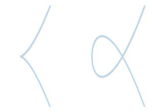

# 简介

椭圆曲线加密体制（ECC，Ellipse Curve Cryptography）与传统的基于大素数因子分解的困难性的加密方法不同，其通过椭圆曲线方程式的性质产生密钥。

使用ECC，164位的密钥便可相当于RSA的1024位密钥提供的保密强度。

ECC的本质是解决知道从椭圆曲线上的一个点移动到该曲线上的另一个点需要多少步的问题。可以证明，即使曲线方程、起始点和结束点都已知，但要求从起始点到结束点一共多少步是一个非常困难的问题，这正是ECC安全性的基础。

# 椭圆曲线

椭圆曲线的由来需要从欧氏几何以及非欧几何开始讲起，由非欧几何可以引出射影平面，而椭圆曲线就是一个在射影平面上满足威尔斯特拉方程的所有点的集合，即椭圆曲线的标准方程是定义在射影平面上的。

## 射影平面

在《几何原本》中，欧几里得提出了五条公设：

1. 由任意一点到任意一点可作直线
2. 一条有限直线可以继续延⻓
3. 以任意点为心及任意的距离可以画圆
4. 凡直⻆都相等
5. 同一平面内一条直线a和另外两条直线b，c相交，若在a某一侧的两个 内⻆的和小于两直⻆，则b，c两直线经无限延⻓后在该侧相交

1820年代，俄国喀山大学罗巴切夫斯基用“至少可以找到两条相异的直线， 且都通过P点，并不与直线R相交”代替第五公设，然后与欧氏几何的前四个 公设结合成一个公理系统，他经过细致深入的推理过程中，得出了一个又一 个在直觉上匪夷所思，但在逻辑上毫无矛盾的几何体系。这种几何学被称为罗巴切夫斯基集合，又称为罗氏几何。

从罗氏几何中，可以得出这样一个结论：逻辑上不矛盾的一些公理都有可能提供一种几何学，现存的一些几何学的类型列举如下：

1. 坚持第五公设，引出欧氏几何
2. 用“可以引最少两条平行线”作为公设，引出罗氏几何（双曲几何）
3. 用“一条平行线也不能引”作为公设，引出黎曼几何（椭圆几何）

射影几何也是直觉上不合适，但逻辑上毫无矛盾的一种几何体系，其最初是由透视图发展出来的，后又由一些数学家逐步建立起了一套完整严谨的射影几何体系。

两条平行线似乎相交于“无穷远处”的消失点。在射影平面里，这是真的。

在射影几何中，平行线交于无穷远点$P∞$，使得平面上任意两条直线都存在唯一交点：

1. 一条直线只有一个无穷远点；一对平行线由公共的无穷远点
2. 任何两条不平行的直线都有不同的无穷远点（否则会造成有两个交点）
3. 平面上全体无穷远点构成一条无穷远直线

> 射影平面：平面上全体无穷远点于全体平常点构成射影平面

射影平面上的点用一个三元坐标表示$(x,y,z)$，对于普通平面上的点$(x_0,y_0)$，令$x_0 = \frac{x_1}{z_1},y_0=\frac{y_1}{z_1}，z_1\ne0$，则对应为射影平面上的点$(x_1,y_1,z_1)$

## 椭圆曲线

椭圆曲线的标准定义是在射影平面上满足威尔斯特拉斯方程(Weierstrass)所有点的集合：
$$
y_1^2z_1+𝑎_1x_1y_1z_1+𝑎_3y_1z_1^2 =x_1^3 +𝑎_2x_1^2z_1+𝑎_4x_1z_1^2 +𝑎_6z_1^3
$$
满足：

1. 椭圆曲线方程是一个齐次方程
2. 椭圆上每个点都必须是非奇异（光滑的），即偏导数$F_x(x,y,z),F_y(x,y,z),F_z(x,y,z)$不同时为0
3. 曲线的形状并非是一个椭圆，只是因为该方程类似求椭圆周长的积分$\int_\alpha^\beta{\frac{dx}{\sqrt{x^3+ax+b}}}$的形式，所以被称之为椭圆曲线方程。

令$x_0=\frac{x_1}{z_1},y_0=\frac{y_1}{z_1}$时，可以得到椭圆曲线的普通方程：
$$
y_0^2+𝑎_1x_0y_0+𝑎_3y_0 =x_0^3 +𝑎_2x_0^2+𝑎_4x_0 +𝑎_6
$$
经过适当的条件限定（特征值为大于3的素数）和变换，椭圆曲线方程可以写成如下形式：
$$
y^2 = x^3 + a_4x + a_6 \\
\Delta = -16(4a_4^3 + 27 a_6^2) \ne 0(该条件可以保证曲线处处是非奇异（光滑）的)
$$
为了描述方便，写成$y^2 = x^3 + ax + b$的形式

不同的椭圆曲线对应不同的形状

奇异(非光滑)点：它们都不是有效的椭圆曲线

另外，我们还需要一个无穷处的点（point at infinity/ideal point）作为曲线的一部分，从现在开始，我们将用$\theta$这个符号表示无穷处的点。如果我们将无穷处的点也考虑进来的话，那么椭圆曲线的表达式精炼为：
$$
\{(x,y)\in\mathbb{R}^2\lvert y^2=x^3+ax+b, 4a^3+27b^2\ne 0\}
$$

# 定义椭圆曲线上的$+$运算

最初的简介里说，ECC的本质是解决知道从椭圆曲线上的一个点移动到该曲线上的另一个点需要多少步的问题。那么，该如何设计这种移动的方法呢？

**两相异点加运算**：任取椭圆曲线上两点P、Q（若P、Q两点重合，则作P点的切线），作直线交于椭圆曲线的另一点R'，过R'作y轴的平行线交于R，定义$P+Q=R$。这样，加法的和也在椭圆曲线上，并同样具备加法的交换律、结合律。

**倍点运算**：过点P的切线与椭圆曲线相交于R'，过R'作y轴的平行线交于R，点P的倍点$2P=R$

由椭圆曲线上所有的点和定义的$+$运算可以构成一个阿贝尔群：

1. 群中的元素就是椭圆曲线上的点
2. 加法规则定义如下：取一条直线上的三点（这条直线和椭圆曲线相交的三点），P, Q, R（皆非零），他们的总和等于$\theta$，$P+Q+R=\theta$
3. 零元就是无穷远处的点$\theta$
4. 相反数P，是关于x轴对称的另一边的点
5. 任给$P,Q\in E$，易证明$P+Q=Q+P$;
6. 任给$P,Q,R \in E$，易证明$(P+Q)+R = P+(Q+R)$

# **有限域**上椭圆曲线的$+$运算

>域是一个可以在其上进行加法、减法、乘法、和除法运算，而结果不会超出域的集合。如有理数集合、实数集合、复数集合是域，但整数集合不是
>
>如果域F只包含有限个元素，则称其为**有限域**

在把椭圆曲线应用到加密上时，需要将椭圆曲线约束在有限域上。具体原因如下：

计算机的精度误差，会导致如果用连续的数（如果有除法运算，会得到小数），明文经过加密解密后会出现偏差，得不到原来的明文。

而有限群，保证了群运算得到的数一直是在有限群里边，明文经过加密解密后可以得到原明文，没有偏差。

给出一个有限域$F_p$：

- $F_p$中有$p$（$p$**为质数**）个元素$0,1,2,...,p-1,p-1$
- $F_p$的加法是$a+b\equiv c(mod\ p)$
- $F_p$的乘法是$a\times b\equiv c(mod\ p)$
- $F_p$的除法是$a \div b\equiv c(mod\ p)$，即$a\times b^{-1}\equiv c(mod\ p)$，$b^{-1}$也是一个0到$p-1$之间的整数，且满足$b \ times b^{-1} \equiv 1(mod\ p)$
- $F_p$的单位元是1，零元是0
- $F_p$域内运算满足交换律，结合律，分配律

$F_p$**上的椭圆曲线：**

> Hass定理：令$F_p$表示**p**个元素的有限域，用$E(F_p)$表示定义在$F_p$上的一个椭圆曲线E，$E(F_p)$上点的个数用$^\#E(F_p)$表示，则
> $$
> \vert\ ^\#E(F_p)-p-1\ \vert \le 2p^{\frac{1}{2}}
> $$

令$p>3,\ a,b \in F_p$，满足$4a^3+27b^2\ne 0$，椭圆曲线方程为$y^2 = x^3 + ax + b$，它的所有解$(x,y)$，$(x\in F_p，y\in F_p)$，连同“无穷远点” $\theta$  组成的集合记为$E(F_p)$，由Hass定理知:
$$
p+1-2p^{\frac{1}{2}} \le \ ^\#E(F_p) \le p+1+2p^{\frac{1}{2}}
$$
对于该有限域上的椭圆曲线有加法：任给$(x,y)\in E(F_p)，$

- 无穷远点$\theta$是零元，有$\theta + \theta = \theta, \theta + P = P$ 

- $P(x,y)$的负元是$(x, -y\ mod\  p) = (x,p-y)$，有$P+(-P)=\theta$

- $P(x_1,y_1),Q(x_2,y_3)$的和$R(x_3,y_3)$有如下关系：
  $$
  x_3 \equiv \alpha^2-x_1-x_2(mod \ p) \\
  y_3 \equiv \alpha(x_1-x_3)-y_1(mod \ p) \\
  若P\ne Q，则\alpha=(y_2-y_1)/(x_2-x_1)\ mod\ p \\
  若P=Q，则\alpha = (3x^2+a)/2y_1\ mod\ p
  $$

如果椭圆曲线上一点P，存在最小的正整数n使得倍加$nP = \theta$，则将n称为P的阶(周期)，记为$\prod(P) = n$。

若n不存在，则P是无限阶的。

# 椭圆曲线加密体制

椭圆曲线的加密原理为：

> 考虑$Q=kP$ ，其中P、Q为椭圆曲线$E(F_p)$上的点，n为P的阶$(nP= \theta)$，k为小于n的整数。则给定k和P，根据加法法则，计算Q很容易，但反过来，给定P和Q，求k就非常困难。实际使用中的ECC原则上把p取得相当大，n也相当大，要把n个解点逐一算出来是不可能的。这就是椭圆曲线加密算法的数学依据。

在实际椭圆曲线加密体制中，具体过程如下：

选取素域$F_p$，在$E(F_p)$中选取一个阶很大的点，如选取点$P=(x,y)$，它的周期为一个大整数n，记$\prod(P) = n$

注：在这个密码体制中，具体的曲线方程以及点P都是公开信息

## 密钥的生成

Bob(使用者)执行了下列计算：

1. 在区间$[1,n-1]$中随机选取一个整数$k$
2. 计算点$Q$， $Q=kP$
3. Bob公开自己的公开密钥：$(E(F_p),P,n,Q)$
4. Bob的私钥为整数$k$

Alice要发送消息m给Bob，Alice执行：

1. 查找Bob的公钥$(E(F_p),P,n,Q)$

2. 将m表示成一个域元素$m\in F_p$

3. 在区间$[1，n-1]$内选取一个随机数d

4. 依据Bob的公钥计算点 $(x_1,y_1)=dP$

5. 计算点$(x_2,y_2)=dQ$,如果$x_2=0$,则回到第3步

6. 计算$C=mx_2$

7. 传送加密数据$(x_1,y_1,C)$给Bob

   注意，此时$(x_2,y_2)$这个点只有用d或者k联立$(x_1,y_1)$能解出来，也就是说，除了Alice和Bob，其他人都无法解得$(x_2,y_2)$

## Bob的解密过程

Bob收到Alice的密文$(x_1, y_1, C)$后，执行

1. 使用私钥k，计算点$(x_2, y_2)=k(x_1, y_1)$，再根据 $x_2x_2^{-1}\ mod\ p = 1$ 计算出$F_p$中的$x_2^{-1}$
2. 通过计算$m=Cx_2^{-1}$，恢复出明文数据m。

**参考文章：**

> [ECC椭圆曲线详解(有具体实例)](https://www.cnblogs.com/Kalafinaian/p/7392505.html)
>
> [Real Cryptography Has Curves: Making The Case For ECC](https://devcentral.f5.com/s/articles/real-cryptography-has-curves-making-the-case-for-ecc-20832)
>
> [ECC椭圆曲线加密算法：介绍](https://zhuanlan.zhihu.com/p/36326221)
>
> [射影平面](https://zh.wikipedia.org/wiki/%E5%B0%84%E5%BD%B1%E5%B9%B3%E9%9D%A2)
>
> [浅说椭圆曲线，陆俊](http://www.global-sci.org/v1/mc/issues/4/no3/freepdf/70s.pdf)

