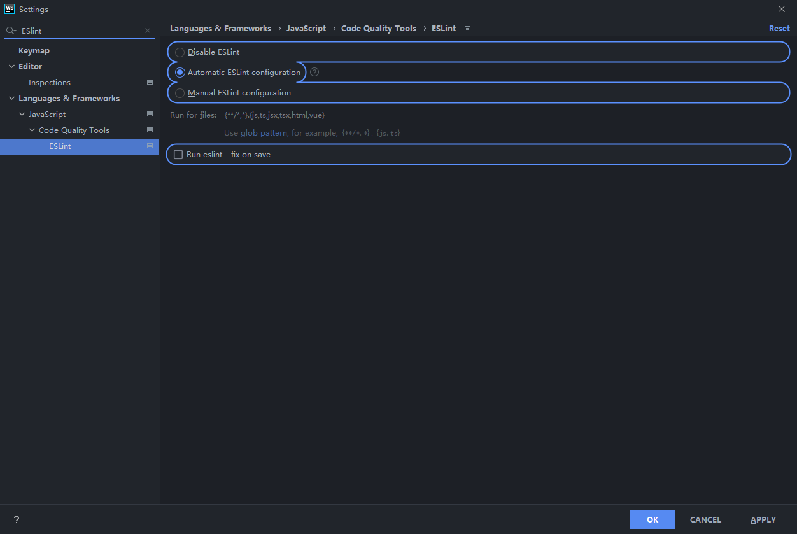
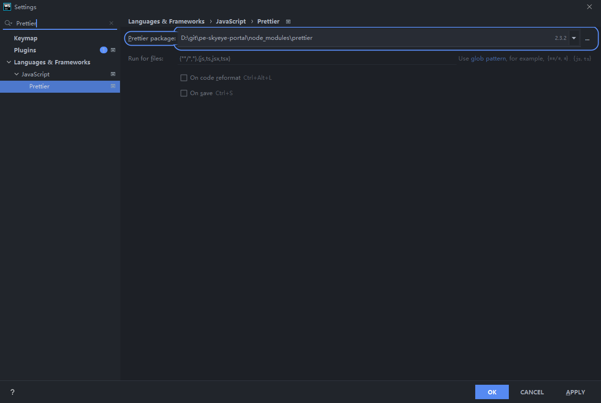

统一项目的代码格式规范对于多人协同开发，项目可读性与维护是十分重要的。前几天为实习公司的`TypeScript`+`Vue`项目配置了`ESLint`+`Prettier`+`Husky`，规范代码风格。

<!-- more -->

### 1. [ESLint](https://eslint.bootcss.com/): 检验代码语法和代码风格

- `eslint`: EsLint的核心代码
- `@typescript-eslint/parser`：ESLint的解析器，用于解析typescript，从而检查和规范Typescript代码
- `@typescript-eslint/eslint-plugin`：这是一个ESLint插件，包含了各类定义好的检测Typescript代码的规范

```bash
1. npm
npm i -D eslint @typescript-eslint/parser @typescript-eslint/eslint-plugin
2. yarn
yarn add eslint @typescript-eslint/parser @typescript-eslint/eslint-plugin --dev -W
```

项目根目录下新建`.eslintrc.js`文件，配置`ESLint`规则:

```jsx
module.exports = {
  root: true,
  env: {
    browser: true,
    node: true,
    es6: true,
  },
  parser: '@typescript-eslint/parser', // .ts 文件解析器，帮助ESLint解析typescript文件
  plugins: ['@typescript-eslint'],
  extends: [
    'eslint:recommended',  // ESLint官方预定义规则集
    'plugin:@typescript-eslint/recommended',  // TypeScript规则集
  ],
  // 自定义规则，配置后会覆盖extends中已有的规则，官方规则配置手册: https://eslint.bootcss.com/docs/rules/
  rules: {
	}
};
```

项目根目录下新建`.eslintignore`文件，配置不需要ESlint检查的文件

```bash
# don't ever lint node_modules
node_modules
# don't lint build output (make sure it's set to your correct build folder name)
dist
# don't lint nyc coverage output
coverage
```

### 2. [Prettier](https://prettier.io/): 检验代码风格

虽然已经配置了ESLint，但是ESLint只能检验js和ts文件的代码风格，不能格式化html和css代码，Prettier可以格式化以上所有文件的代码（但不会做语法检查），ESLint搭配Prettier使用效果会更好。

- `prettier`：prettier插件的核心代码
- `eslint-config-prettier`：解决ESLint中的样式规范和prettier中样式规范的冲突，以prettier的样式规范为准，使ESLint中的样式规范自动失效
- `eslint-plugin-prettier`：将prettier作为ESLint规范来使用

```bash
1. npm
npm i -D prettier eslint-config-prettier eslint-plugin-prettier
2. yarn
yarn add prettier eslint-config-prettier eslint-plugin-prettier --dev -W
```

项目根目录下新建`.prettierrc.js`文件，配置`Prettier`规则

```jsx
module.exports = {
  tabWidth: 2,
  useTabs: false,
  semi: true, // 语句结尾统一使用分号
  singleQuote: true, // 全程使用单引号
  trailingComma: 'all', // 结尾处必须添加逗号
};
```

更改`.eslintrc.js`文件

```jsx
module.exports = {
  extends: [
      // ...其他lint
      // 为了保证格式化后代码都以prettier为准，把这项配置放到数组最后
      "plugin:prettier/recommended"  // Prettier规则集
  ]
}
```

### 3. 为Vue文件配置ESLint

需要使用Vue官方提供的[`eslint-plugin-vue`](https://eslint.vuejs.org/)包来对vue文件进行lint操作

```bash
1. npm
npm i -D eslint-plugin-vue
2. yarn
yarn add eslint-plugin-vue --dev -W
```

更改`.eslintrc.js`文件

> **注意：**若eslint集成了eslint-plugin-vue去校验vue代码，由于eslint-plugin-vue插件也使用parse配置项（vue-eslint-parser），因此集成typescript需要把这个值配置到parserOptions

```jsx
module.exports = {
  root: true,
  env: {
    browser: true,
    node: true,
    es6: true,
  },
  parser: 'vue-eslint-parser', // .vue 文件解析器，帮助ESLint解析vue文件
  plugins: ['@typescript-eslint'],
  extends: [
    'eslint:recommended',  // ESLint官方预定义规则集
    'plugin:vue/recommended',  // Vue规则集
    'plugin:@typescript-eslint/recommended',  // TypeScript规则集
    'plugin:prettier/recommended',  // Prettier规则集
  ],
  parserOptions: {
    parser: '@typescript-eslint/parser', // .ts 文件解析器，帮助ESLint解析typescript文件
  },
  // 官方规则配置手册: https://eslint.bootcss.com/docs/rules/
  rules: {
	}
};
```

### 4. 配置Husky+lint-staged

使用`Husky`+`lint-staged`可实现在`git commit` 提交代码时，执行`ESLint`检验与格式化处理

- [`husky`](https://www.npmjs.com/package/husky)可用于在执行git命令操作时自定义命令，比如在代码被`commit`到本地仓库前，可以让我们定义一些预检查和格式化等工作，其实现涉及到[Git Hooks](https://git-scm.com/book/zh/v2/%E8%87%AA%E5%AE%9A%E4%B9%89-Git-Git-%E9%92%A9%E5%AD%90)的原理，
- [`lint-staged`](https://www.npmjs.com/package/lint-staged)库是一个可对处于git暂存区文件（被`git add`的文件）进行自定义逻辑的库

```bash
1. npm
npm i -D husky@4.3.6 lint-staged   (husky5版本的配置稍微复杂些，4版本足够满足日常需求)
2. yarn
yarn add husky@4.3.6 lint-staged --dev -W
```

`package.json`文件中添加配置项

```bash
{
	"husky": {
    "hooks": {
      "pre-commit": "lint-staged"  // commit命令执行前执行lint-staged中配置的操作
    }
  },
  "lint-staged": {
    "./**/*.{ts,vue}": [      // 对项目中所有ts和vue文件执行prettier --write 和 eslint --fix 命令
      "prettier --write",
      "eslint --fix"
    ],
    "./**/*.{html,css}": [
      "prettier --write"  // 对项目中所有html和css文件执行prettier --write命令
    ]
  }
}
```

这样在每次执行`git commit`命令时，都会对暂存区中的文件执行自动格式化操作，如果格式化不成功(`ESLint`的`error`会格式化失败，`warn`不会)，则`commit`失败，帮助规范代码。

### 5. 集成IDE

**VSCode**

需要安装插件：

```bash
Prettier
ESLint
```

**WebStorm**

已集成以上插件

settings中搜索ESLint， 配置Automatic ESLint configuration， 若选中Run eslint --fix on save，则每次保存文件时，会自动使用ESLint格式化代码



settings中搜索Prettier，配置Prettier packages目录



- 在`.eslintrc.js`文件上右键→`Apply ESLint Code Style Rules`
- 在`.prettierrc.js`文件上右键→`Apply Prettier Code Style Rules`
- 使用Ctr+Shift+P可以使用Prettier格式化代码
- 在文件目录书中对某个文件右键→`Fix ESLint Problems`，使用ESLint格式化代码

### 6. 一些常用命令

```bash
# prettier格式化所有ts文件
# ./表示当前目录， **/表示中间0-n个目录，*.ts表示所有ts文件
yarn run prettier --write ./**/src/**/*.ts
# 格式化多种文件类型
yarn run prettier --write ./**/src/**/*.{ts,vue,html,css}

# ESLint格式化当前所有ts文件
yarn run eslint --fix ./**/src/**/*.ts
# 格式化多种文件类型
yarn run eslint --fix ./**/src/**/*.{ts,vue,html,css}
```

### 7. 配置[`.editorconfig`](https://editorconfig.org/)

[官网](https://editorconfig.org/)介绍：EditorConfig帮助开发人员在不同的编辑器和IDE之间定义和维护一致的编码样式。EditorConfig项目由用于定义编码样式的文件格式和一组文本编辑器插件组成，这些插件使编辑器能够读取文件格式并遵循定义的样式。EditorConfig文件易于阅读，并且与版本控制系统配合使用。

在项目根目录新建`.editorconfig`文件，IDE（Webstorm内置editorconfig插件，VSCode需单独安装）借助editorconfig插件可以读取该文件并规范代码风格，如缩进字符数等等。下面是一份简单的`.editorconfig`配置。

```bash
[*.{js,jsx,ts,tsx,vue}]
#缩进风格：空格
indent_style = space
#缩进大小2
indent_size = 2
#换行符lf
end_of_line = lf
#字符集utf-8
charset = utf-8
#是否删除行尾的空格
trim_trailing_whitespace = true
#是否在文件的最后插入一个空行
insert_final_newline = true
#单行最大长度(与ESLint冲突)
# max_line_length = 100
```

### 参考文章 📚

[使用EsLint+Prettier规范TypeScript代码](https://www.jianshu.com/p/cd2a2e5db29a)

[eslint规则在项目中的整合(js、prettier、vue、typescript)](https://www.panyanbin.com/article/b679027e.html)

[Vue + TypeScript 项目放弃 TSLint，拥抱 ESLint](https://juejin.cn/post/6844904074534453261)

