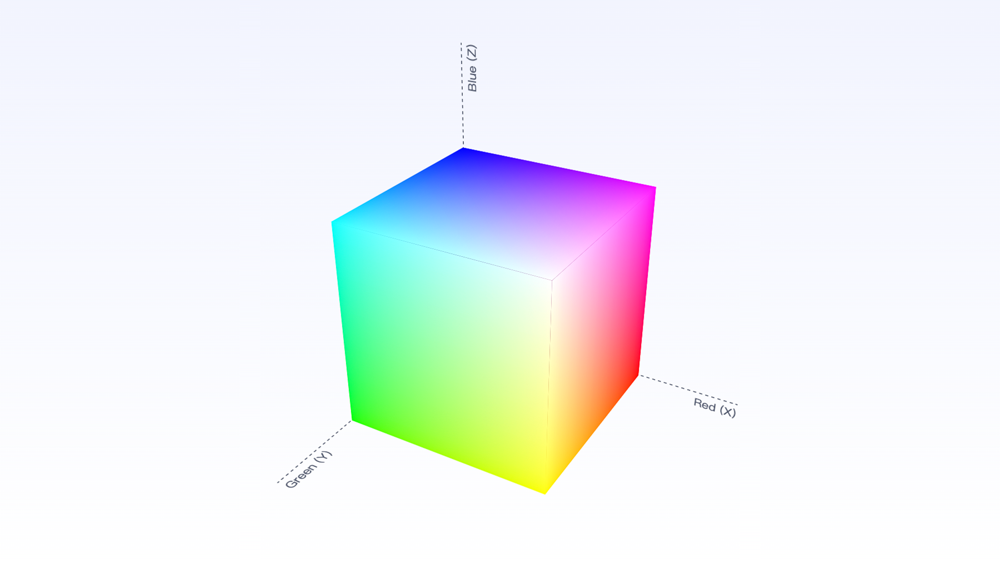
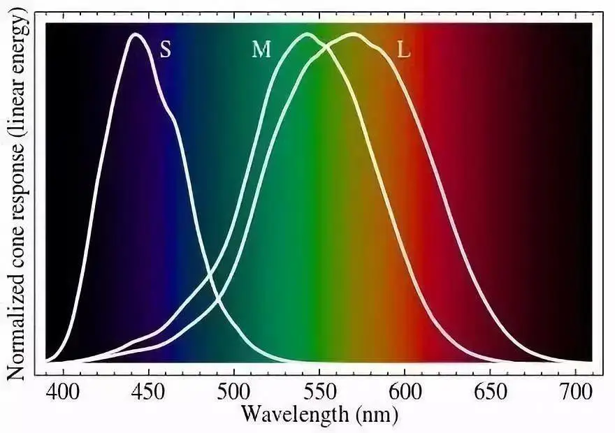

最近学习了一下调色，发现色彩中原来还有那么多有趣的知识，记录一下学习过程。

调色的本质是调整图片的色的表现，使图片达到预期的效果。学习调色可以分为两个大部分，一是要了解色彩的基本原理，要知道调整颜色的什么属性可以实现什么样的效果，不然只能没有章法的乱调一通；二就是要培养自己的审美，在调色前要有一个预期效果，不然懂得了工具的使用也是无头苍蝇。

​	<!-- more -->

# 原色

原色是指不能通过其他颜色的混合调配而得出的"基本色"。肉眼所见的色彩空间通常由三种基本色所组成，称为"三原色"，意思是可以用这三种颜色将人肉眼能感知到的大部分颜色表示出来。

## 色彩空间

从基本的“红绿蓝（RGB）”开始，我们都知道，红绿蓝三种颜色可以表示出人肉眼能感知到的大部分颜色【为什么说是大部分而不是所有，这涉及到人类的颜色感受的内部机理，详细的可以去看**[CIE 1931色彩空间](https://zh.wikipedia.org/wiki/CIE_1931%E8%89%B2%E5%BD%A9%E7%A9%BA%E9%97%B4)】**。

想象一个三维直角坐标系，它的XYZ轴分别是RGB轴，那么色彩空间就可以表示为：

*图片来源：[色彩空间（一）：色彩空间基础](https://www.zhangxiaochun.com/color-space-1/)*

通过线性代数的基本知识我们可以知道，只要是向量空间中的三个互不线性相关（线性独立）的向量，都可以成为该向量空间的一组基，因此三原色可以有无穷多种，小时候接触过红黄蓝是美术三原色的说法，在图中可以看出，红黄蓝是三个线性独立的向量，因此也可以表示为该色彩空间中的任何颜色。【注：这个说法并不准确，因为颜色不能被表示为负值，黑色是0，所以红黄蓝只是能表示该色彩空间中的一部分颜色，古代人对色彩的认知不够全面，通过经验把红黄蓝定义为了美术三原色，这三种颜色组成的部分颜色对于画画来说也基本够用】只不过随着人们对色彩的认知逐渐加深，现在我们最规定最常用的三原色是：光学三原色：红绿蓝和美术三原色：青品黄。

**为什么不同颜色混合可以得到新的颜色？**

我们都知道，不同颜色的光本质上是不同波长的电磁波，两种颜色混合可以得到另一种颜色，难道是两种不同波长的电磁波混合之后得到了两外一种波长的电磁波吗？当然不是。

这是因为人负责感受光的视锥细胞一种有三种，三种细胞对不同波长的光的敏感程度不同，颜色的表现是这三种视锥细胞综合感光，然后把信息传递给大脑产生的主观感觉。

## 加色模式与减色模式

*黑色发光体RGB加色，与白色反光体青品黄减色*

从图中可以看出：

在红绿蓝三原色模式下：

- 红+绿=黄
- 绿+蓝=青
- 蓝+红=品红

在青品黄三原色模式下：

- 品红+黄=红
- 黄+青=绿
- 青+品红=蓝

既然三原色就可以表示出大部分颜色，那么为什么还要分成光学三原色和美术三原色两种：“红绿蓝”和“青品黄”，这涉及到两种发光情况以及对应的加色模式和减色模式。

想象一个物体，它不发出任何光线，空间中也没有任何光照，那么这个物体在人眼看来就是纯黑色，而如果该物体可以发出红绿蓝三种不同颜色和不同强度的光，那么就可以通过调节三种颜色的强度来达到其它颜色的效果。

再想象一种情况，一张白纸之所以在人眼看来是白色，不是因为它本身会发出白光，而是白纸会将环境中的可见光全部反射出来，人眼看到的是其反射的光。

以上两种情况是不同的，一种是**物体的自发光**，一种是**物体的反射光**，区分好这两个概念，才能理解好加色模式与减色模式。

### **光学三原色红绿蓝与加色模式**

在常用的液晶显示屏中，一般都会有三种颜色（红绿蓝）的发光元件，通过调整三种发光元件发光的比例和强度，来实现显示各种颜色的目的。

**在加色模式中，黑色是各种颜色的空白状态，这时若要产生颜色，就要通过增加各种色彩的光线来产生，当各类色彩都加到最大值后形成了白色。**

**为什么是红绿蓝？**

如果看了上文中提到的**[CIE 1931色彩空间](https://zh.wikipedia.org/wiki/CIE_1931%E8%89%B2%E5%BD%A9%E7%A9%BA%E9%97%B4)**，我们可以知道，人体的颜色感应机理使我们所能感知的颜色要比上文提到的RGB三维直角坐标系色彩空间中的颜色要多，而通过红绿蓝三种颜色能够尽可能多的调出大部分的色彩。

上面说到，颜色的感觉是人体三种视锥细胞综合感光作用的结果。更详细的来说，三种视锥细胞对不同波长光的敏感程度如图所示，视锥蛋白可以进一步分为**长波敏感视蛋白**（红）、**中波敏感视蛋白**（绿）和**短波敏感视蛋白**（蓝）。通过这三种颜色进行颜色调配，会使人的视锥细胞反应更敏感，这也就是为什么光学三原色是红绿蓝的原因。

### **美术三原色青品黄与减色模式**

减色模式常用在印刷中，因为一般印刷是在白纸上进行的，白纸通过反射光产生颜色。

以品红色为例，我们可以看到，在RGB三原色中，品红+绿=(红+蓝)+绿=白，那么当我们在白纸上印刷品红色时，就相当于过滤掉了白色中的绿色，只留下了红色和蓝色。

如果我们要在白纸上印刷红色，那么可以再过滤掉蓝色，即印刷上黄色（黄+蓝=(红+绿)+蓝=白）。

印刷了品红和黄色之后，过滤掉了绿色和蓝色，就剩下了红色光。

这就是青品黄三原色进行印刷或绘画的基本原理。印刷品红相当于过滤掉了绿色，这就是所谓的减色模式。

**原理我看懂了，但是还是没讲为什么印刷一定要用青品黄，我就直接用红绿蓝三种颜色进行印刷不行吗？**

可以但不能完全可以。

想一下，如果我们想在白纸上印刷品红色，根据RGB三原色，我们需要在纸上同时印刷红色和蓝色，在印刷红色时，我们过滤掉了蓝色和绿色，在印刷蓝色时，我们过滤掉了红色和绿色，一下过滤了四次颜色，这样的话，白纸显示出的品红色会非常的暗，事实也证明的确如此，如果颜料品质不好的话，甚至会变成棕黑色。

**我也可以说印了品红是过滤掉了青色和黄色，这样也是过滤掉了两种颜色，为什么这就不暗了呢？**

个人理解，并不一定对，还记得上面所说的红绿蓝三种视锥细胞吗，人眼对红绿蓝三种颜色是最敏感的，过滤了两次的红绿蓝，和过滤了两次的青品黄，在人眼中的感受是不一样的，人眼对前者的感受更强烈。

## 补色

综上，我们总结出以下关系：

- 红+青=白
- 绿+品红=白
- 蓝+黄=白

即，红和青互为补色，绿和品红互为补色，蓝和黄互为补色。

即在调色时，增加红色和减少青色都能实现将画面变红的目的。

# 色彩三要素

色彩三要素分别为：色相（H，Hue）、纯度（饱和度）（S，Saturation）、亮度（明度）（B，Brightness）。

**色相：**色相是色彩的第一要素，色相就是色名，是区分色彩的名称。在可见光谱上，人的视觉能感受到红、橙、黄、绿、青、蓝、紫这些不同特征的色彩，就是所谓的色相。

**纯度（饱和度）：**颜色鲜艳的程度，纯度越高，颜色越鲜艳，越低，则相反。当纯度为0%的时候则为白色（明度为100%的情况下），100%的时候则是纯度最高，也是最鲜艳的。

**亮度（明度）：**指人眼所直观感受到的色彩的亮度，如一个红色的物体，用白光照射它，光照的强度不同，该物体的颜色亮度也会不同。

## HSB与HSL

HSB和HSL都是RGB模型的替代表示，都用色相、饱和度和亮度来表示颜色，只是两者对饱和度和亮度的定义略有不同。

HSB可以看成是在一个白色物体上涂颜料，并用白色光照射这个物体，饱和度就是涂的颜料的多少，亮度就是照射这个物体的白光的强度。以红色为例，当红色涂的比较少时（饱和度较低）（只有薄薄的一层，过滤绿色和蓝色不彻底），物体会呈现出浅红色；当照射这个物体的白光强度越大（亮度越高），颜色就越亮，当饱和度和亮度都最高时，物体呈现最鲜艳的红色。当然以上是一种抽象理解，在实际操作中可以这样想象，并不是指实际定义。

PhotoShop中HSB拾色器

HSL模型比较难对应到现实中的物品，但可以直观的理解为，明度一定，饱和度越高时，颜色就越鲜艳，饱和度一定，明度越高时，颜色就越接近于白色（观感上更亮）。因此，使用HSL可以确保调整“鲜艳度”的时候，对亮度的影响不那么大。所以照片调色软件，主用HSL的居多，比如Adobe的Lightroom。

HSL拾色器

换句话说，对于HSL的S，我们会说“这个颜色鲜艳不鲜艳”，而对HSB的S则会说“这个颜色纯不纯”。而对于L和B，对L的形容是“这个光白不白”，而对B的形容是“这个光亮不亮”。

**HSL的S（饱和度）定义更符合直觉**，而**HSB的B（明度）定义更符合直觉**。这两个模型都是为了**在颜色选择方面方便人机交互**设计的，它们的优劣也就在于具体使用者的理解倾向，或者软件使用场景对具体参数的要求上。

# 参考：

[关于*调色*你必须要知道的知识](https://zhuanlan.zhihu.com/p/61616273)

[谁才是真正的三原色](http://www.yunxyx.com/articledetails/1472)

[色彩空间（一）：色彩空间基础](https://www.zhangxiaochun.com/color-space-1/)

[hsl模型是否优于hsv模型？](https://www.kamilet.cn/difference-between-hsl-and-hsv/)

[RGB vs HSB vs HSL — Demystified](https://medium.com/innovaccer-design/rgb-vs-hsb-vs-hsl-demystified-1992d7273d3a)

[CIE 1931色彩空间](https://zh.wikipedia.org/wiki/CIE_1931%E8%89%B2%E5%BD%A9%E7%A9%BA%E9%97%B4)